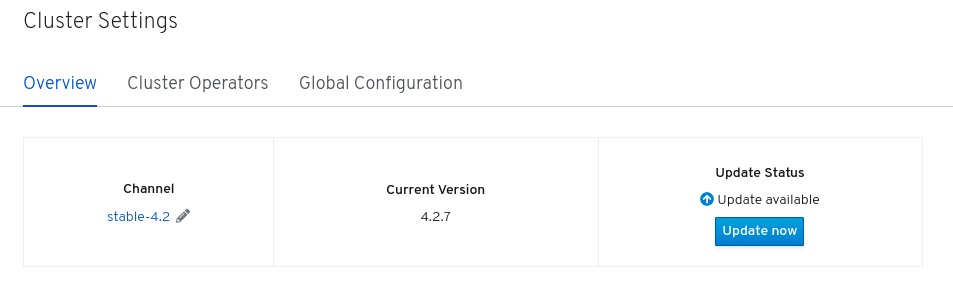
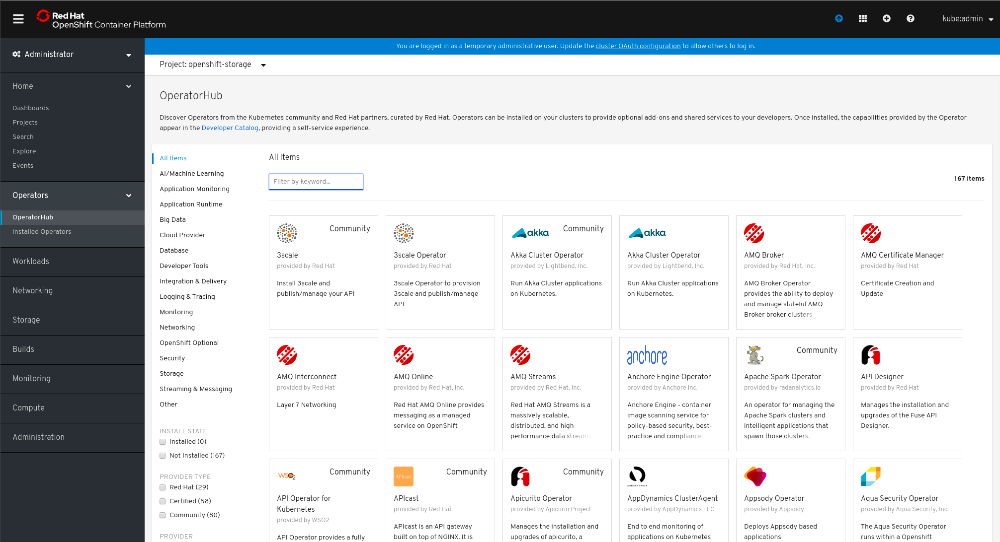
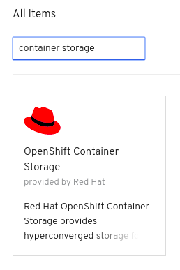
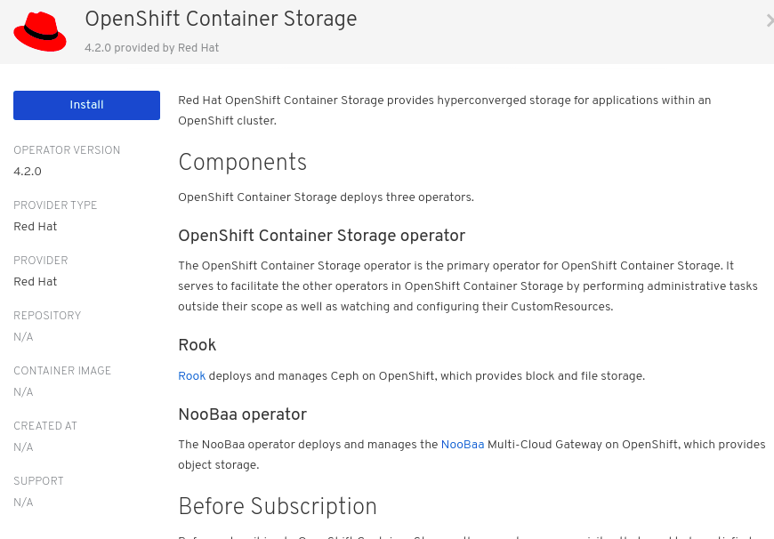
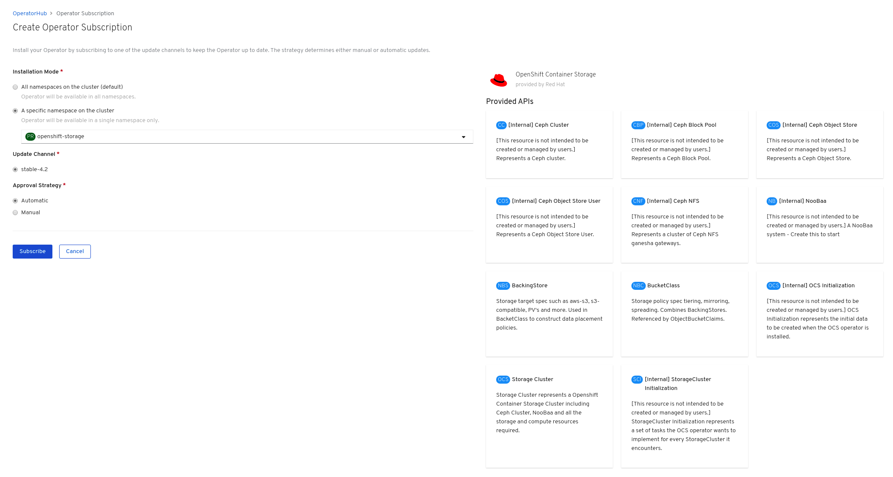
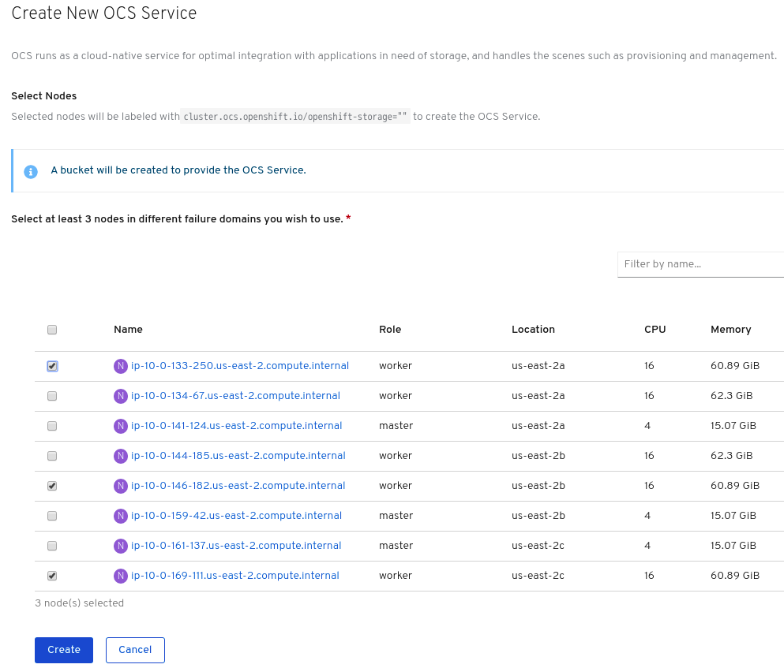
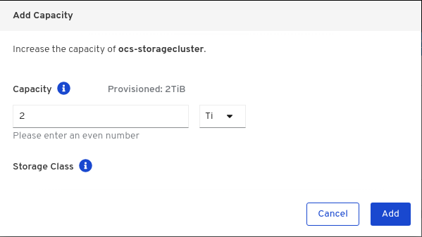

= ハンズオン: OpenShift Container Storageのデプロイと管理
//:toc: left
:toclevels: 2
:icons: font
:source-highlighter: coderay
:coderay-linenums-mode: inline
//:source-language: shell
:numbered:
// Activate experimental attribute for Keyboard Shortcut keys
:experimental:
:xrefstyle: short

== 概要
このハンズオンワークショップは、Red Hat OpenShift Container Storage(OCS) 4のデプロイおよび管理の方法を学習します。 +
このハンズオンワークショップは、OCS 4に関心のあるシステム管理者、およびアプリケーション開発者の両方を対象者として想定します。 +
このハンズオンでは、OpenShift Container Storage Operatorを使用して、OpenShift Container Platform(OCP) 4向けの永続ストレージのソリューションである、CephとMulti-Cloud Gateway(MCG)を、OCP 4.2のクラスターにデプロイします。

=== このハンズオンで学習する内容

* OCS Operatorを使用して、OCPクラスター上にCephクラスターとMCGをデプロイする
* デプロイされたCephクラスターとMCGを確認する
* Rook toolboxを使用して、CephコマンドとRADOSコマンドを実行し、構成を確認する
* Ceph RBDが提供するReadWriteOnce(RWO) PVCを作成し、アプリケーションから使用する
* CephFSが提供するReadWriteMany(RWX) PVCを作成し、アプリケーションから使用する
* MCGを使用してObject Bucketを作成し、アプリケーションから使用する
* 構成したCephクラスターにストレージ容量を追加する
* OCSのモニタリングを行う

.OpenShift Container Storage コンポーネント
image::imgs/OCS-Pods-Diagram.png[Showing OCS4 pods]

== OCS Operatorを使用してCephストレージバックエンドをデプロイする

=== OCPクラスターをアップデートする

このセクションでは、OCPクラスターのバージョンを確認し、必要があればOCPクラスターをアップデートします。

CAUTION: OCSはOCP 4.2.13以上での利用がサポートされます。 +
参考リンク: https://access.redhat.com/articles/4731161[Red Hat OpenShift Container Storage and Red Hat OpenShift Container Platform interoperability matrix]

==== OCPクラスターのバージョンを確認する

OpenShift Web Consoleにログインし、左側の `Administrator` メニューから `Cluster Settings` を選択します。 +
`OverView` タブの上部にある `Current Version` にOCPクラスターのバージョンが表示されていることを確認します。(<<ocpversion>>)

[[ocpversion]]
.OCP Version

NOTE: `oc version` コマンドでもOCPクラスターのバージョンを確認することができます。

==== OCPクラスターをアップデートする
OCPクラスターのバージョンがすでに4.2.13以上の場合はアップデートは必要ありませんので、スキップして下さい。

OCPクラスターのバージョンが4.2.13未満であればアップデートが必要です。 +
<<ocpversion>>のように、Web Consoleの `Update Status` の表示にある *[Update now]* ボタンから、4.2.13以上のバージョンにアップデートします。 +

NOTE: アップデートが完了するまで次のセクションには進まずに待って下さい。アップデートが完了するには20分ほどかかる場合があります。

''''
=== OCPクラスターにOCS用のノードを追加する

このセクションでは、OCS用に3つのworker nodeを追加します。 +
はじめにOCPクラスターに3つのmaster nodeと3つのworker nodeがあることを確認します。

----
oc get nodes --sort-by=".metadata.creationTimestamp"
----
.出力例:
----
NAME                                         STATUS   ROLES    AGE   VERSION
ip-10-0-133-6.us-east-2.compute.internal     Ready    master   82m   v1.14.6+9fb2d5cf9
ip-10-0-150-168.us-east-2.compute.internal   Ready    master   82m   v1.14.6+9fb2d5cf9
ip-10-0-163-84.us-east-2.compute.internal    Ready    master   82m   v1.14.6+9fb2d5cf9
ip-10-0-131-66.us-east-2.compute.internal    Ready    worker   75m   v1.14.6+9fb2d5cf9
ip-10-0-144-235.us-east-2.compute.internal   Ready    worker   75m   v1.14.6+9fb2d5cf9
ip-10-0-162-186.us-east-2.compute.internal   Ready    worker   75m   v1.14.6+9fb2d5cf9
----

ここでmachinesetsを使用して、さらに3つのworker nodeをクラスターに追加します。 +
まず既存のmachinesetsを確認します。AWS Availability Zone(us-east-2a、us-east-2b、us-east-2c)ごとにmachinesetsがあることがわかります。

----
oc get machinesets -n openshift-machine-api
----

.出力例:
----
NAME                                         DESIRED   CURRENT   READY   AVAILABLE   AGE
cluster-tokyo-0f59-7kg4m-worker-us-east-2a   1         1         1       1           83m
cluster-tokyo-0f59-7kg4m-worker-us-east-2b   1         1         1       1           83m
cluster-tokyo-0f59-7kg4m-worker-us-east-2c   1         1         1       1           83m
----

次のコマンドでOCSで利用するmachinesetsを追加します。

----
CLUSTERID=$(oc get machineset -n openshift-machine-api -o jsonpath='{.items[0].metadata.labels.machine\.openshift\.io/cluster-api-cluster}')
curl -s https://raw.githubusercontent.com/tutsunom/ocs-training/jp/ocp4ocs4/cluster-workerocs-us-east-2.yaml | sed "s/CLUSTERID/$CLUSTERID/g" | oc apply -f -
----

新しいmachinesetsがOCPクラスターに追加されていることを確認します。 +
新しく作られたworkerocs machinesetsの全てで `READY` と `AVAILABLE` のカラムに数値(この場合は`1`)が表示されるまで待ちます。このステップには10分ほどかかる場合があります。
----
watch oc get machinesets -n openshift-machine-api
----
.出力例:
----
NAME                                            DESIRED   CURRENT   READY   AVAILABLE   AGE
cluster-tokyo-0f59-7kg4m-worker-us-east-2a      1         1         1       1           62m
cluster-tokyo-0f59-7kg4m-worker-us-east-2b      1         1         1       1           62m
cluster-tokyo-0f59-7kg4m-worker-us-east-2c      1         1         1       1           62m
cluster-tokyo-0f59-7kg4m-workerocs-us-east-2a   1         1         1       1           8m26s
cluster-tokyo-0f59-7kg4m-workerocs-us-east-2b   1         1         1       1           8m26s
cluster-tokyo-0f59-7kg4m-workerocs-us-east-2c   1         1         1       1           8m25s
----
kbd:[Ctrl+C]を押すと終了できます。

次に、新しいmachinesが作られていることを確認します。全てのmachinesの `STATE` が `running` であることを確認します。

----
oc get machines -n openshift-machine-api
----
.出力例:
----
NAME                                                  STATE     TYPE         REGION      ZONE         AGE
cluster-tokyo-0f59-7kg4m-master-0                     running   m4.xlarge    us-east-2   us-east-2a   43m
cluster-tokyo-0f59-7kg4m-master-1                     running   m4.xlarge    us-east-2   us-east-2b   43m
cluster-tokyo-0f59-7kg4m-master-2                     running   m4.xlarge    us-east-2   us-east-2c   43m
cluster-tokyo-0f59-7kg4m-worker-us-east-2a-xlwjs      running   m5.2xlarge   us-east-2   us-east-2a   41m
cluster-tokyo-0f59-7kg4m-worker-us-east-2b-sghmb      running   m5.2xlarge   us-east-2   us-east-2b   41m
cluster-tokyo-0f59-7kg4m-worker-us-east-2c-g5d2q      running   m5.2xlarge   us-east-2   us-east-2c   41m
cluster-tokyo-0f59-7kg4m-workerocs-us-east-2a-276jf   running   m5.4xlarge   us-east-2   us-east-2a   4m1s
cluster-tokyo-0f59-7kg4m-workerocs-us-east-2b-xfb2v   running   m5.4xlarge   us-east-2   us-east-2b   4m
cluster-tokyo-0f59-7kg4m-workerocs-us-east-2c-bxdvr   running   m5.4xlarge   us-east-2   us-east-2c   4m
----

また、workerocs machinesが使用しているAWS EC2インスタンスタイプが `m5.4xlarge` であることがわかります。

NOTE: `m5.4xlarge` インスタンスタイプは16 vCPUと64GB MEMのリソースを持ちます。これはOCSで求められる最小のスペックです。 +
参考リンク: https://access.redhat.com/documentation/en-us/red_hat_openshift_container_storage/4.2/html/planning_your_deployment/infrastructure-requirements_rhocs[Red Hat OpenShift Container Storage 4.2 Planning Your Deployment]

最後に、3つのworker nodeが追加されていることを確認します。全てのworker nodeの `STATUS` が `Ready` であることを確認します。
----
oc get nodes -l node-role.kubernetes.io/worker
----
.出力例:
----
[utubo@tutsunom ocsadmin]$ oc get nodes -l node-role.kubernetes.io/worker
NAME                                         STATUS   ROLES    AGE    VERSION
ip-10-0-131-66.us-east-2.compute.internal    Ready    worker   108m   v1.14.6+9fb2d5cf9
ip-10-0-144-235.us-east-2.compute.internal   Ready    worker   108m   v1.14.6+9fb2d5cf9
ip-10-0-162-186.us-east-2.compute.internal   Ready    worker   108m   v1.14.6+9fb2d5cf9
ip-10-0-141-253.us-east-2.compute.internal   Ready    worker   101s   v1.14.6+9fb2d5cf9
ip-10-0-151-3.us-east-2.compute.internal     Ready    worker   100s   v1.14.6+9fb2d5cf9
ip-10-0-172-190.us-east-2.compute.internal   Ready    worker   99s    v1.14.6+9fb2d5cf9
----

'''

=== OCS Operatorをインストールする

このセクションでは、Web ConsoleのOperatorHubからOCS Operatorをインストールします。 +

==== OCSが稼働する namespace を作成する
はじめにOCSが稼働するための `openshift-storage` namespace を作成します。次のコマンドを実行します。
----
oc create -f https://raw.githubusercontent.com/tutsunom/ocs-training/jp/ocp4ocs4/rhocs-namespace.yaml
----

NOTE: `openshift-storage` namespaceは、Web Consoleや `oc create namespace` コマンドで作成しても構いません。ただしStorage Dashboardでメトリクスとアラートを取得するために、 `openshift-storage` namespaceには `cluster-monitoring=true` のラベルを付けて下さい。

==== OCP OperatorHubからOCS Operatorをインストールする
次にWeb ConsoleのOperatorHubから、OCS Operatorをインストールします。 +
Web Console左側の `Operators` メニューの `OperatorHub` を選択します。(<<operatorhub>>) 

[[operatorhub]]
.OCP OperatorHub

*Filter by _keyword..._* のボックスに、 `container storage` と入力すると、 `OpenShift Container Storage Operator` が表示されます。(<<ocsoperator>>)

[[ocsoperator]]
.OpenShift Container Storage Operator

表示された `OpenShift Container Storage Operator` を選択し、 *Install* ボタンを押します。(<<ocsinstall>>)

[[ocsinstall]]
.OpenShift Container Storageのインストール

次の画面で、設定が<<ocssubscribe>>に示すとおりであることを確認し、*Subscribe* をクリックします。

CAUTION: `Installation Mode` を `A specific namespace on the cluster` に変更して、 `openshift-storage` namespaceを選択して下さい。

[[ocssubscribe]]
.OpenShift Container StorageのSubscribe

ターミナルで下のコマンドを実行してOCS Operatorのインストール状況を確認できます。 +
Operatorの `PHASE` が `Succeeded` に変わるまで待って下さい。変わるまで数分かかる場合があります。
----
watch oc get csv -n openshift-storage
----
.出力例:
----
NAME                  DISPLAY                       VERSION   REPLACES   PHASE
ocs-operator.v4.2.0   OpenShift Container Storage   4.2.0                Succeeded
----
kbd:[Ctrl+C]を押すと終了できます。

OCS Operatorのインストールが終わると、いくつかの新しいPodが `openshift-storage` namespaceに作成されていることが確認できます。

----
oc get pods -n openshift-storage
----
.出力例:
----
NAME                                     READY   STATUS    RESTARTS   AGE
noobaa-operator-7c55776bf9-kbcjp         1/1     Running   0          3m16s
ocs-operator-967957d84-9lc76             1/1     Running   0          3m16s
rook-ceph-operator-8444cfdc4c-9jm8p      1/1     Running   0          3m16s
----

ここでは3つのOperator Podが表示されています。最初にOCS Operator Podが実行されます。OCS Operatorが実行されることでRook-Ceph OperatorとNooBaa Operatorの2つのOperator Podが展開されます。

NOTE: OCS Operatorは、Rook-Ceph OperatorとNooBaa OperatorをOperateする"Meta Operator"です。

以上でOCSの構成に必要となるOperatorがインストールされました。

==== OCS Cluster Serviceを構成する
次にOCS Cluster Serviceを構成します。このステップで、Rook-Ceph OperatorによってバックエンドストレージとなるCephクラスターが作成され、NooBaa OperatorによってMulti-Cloud Gateway(MCG)サービスが作成されます。

Web Consoleに戻ります。 `Operators` メニューの `Installed Operators` を選択し、画面で
`openshift-storage` プロジェクトを選択すると、<<installedoperators>>のような内容が表示されます。

[[installedoperators]]
.Installed Operators
image::imgs/OCP-installed-operators.jpg[Openshift showing the installed operators in namespace openshift-storage]

[cols="0,10a"]
|===
|① |`openshift-storage` プロジェクトを選択
|② | Operatorのステータスが `InstallSucceeded` 
|③ | インストールされたOCS Operatorが表示されている
|===

`Openshift Container Storage Operator` をクリックすると、(<<ocsoperatordetail>>)のようなOCS Operatorの詳細画面に移動します。

[[ocsoperatordetail]]
.OCS Operator detail
image::imgs/OCS-config-screen-all.png[OCS configuration screen]

画面の上部のスクロールバーを動かして `Storage Cluster` を選択し、 *[Create OCS Cluster Service]* ボタンをクリックします。(<<ocscreatestoragecluster>>) +
ボタンが表示されない場合はブラウザウィンドウを更新して下さい。

[[ocscreatestoragecluster]]
.OCS Create Storage Cluster
image::imgs/OCS-config-screen-storage-cluster.png[OCS Create Storage Cluster]

次の画面ではOCS Cluster Serviceを構成するノードを選択します。(<<selectnodes>>)

[[selectnodes]]
.Select Nodes

ここで、*3つの異なるAvailability Zoneのworker nodeを選択することが必要です。*
適切なworker nodeを選択するには、次のコマンドで `role=storage-node` ラベルを検索して見つけることができます。
----
oc get nodes --show-labels | grep storage-node |cut -d' ' -f1
----
上のコマンドで表示された3つのworker nodeのチェックボックスをマークします。

CAUTION: 異なるAvailability Zoneではないworker nodeを選択することはサポートされません。

*[Create]* をクリックするとOCS Cluster Serviceの作成が始まり、`openshift-storage` namespaceで多くの新しいpodが作成されます。
その前にターミナルで次のコマンドを実行しておくと、次々とPodが作成される様子が確認できます。

----
watch oc -n openshift-storage get pods
----
.作成途中の出力例:
----
NAME                                            READY   STATUS              RESTARTS   AGE
csi-cephfsplugin-72n5r                          3/3     Running             0          52s
csi-cephfsplugin-cgc4p                          3/3     Running             0          52s
csi-cephfsplugin-ksp9j                          3/3     Running             0          52s
csi-cephfsplugin-provisioner-849895689c-5mcvm   4/4     Running             0          52s
csi-cephfsplugin-provisioner-849895689c-k784q   4/4     Running             0          52s
csi-cephfsplugin-sfwwg                          3/3     Running             0          52s
csi-cephfsplugin-vmv77                          3/3     Running             0          52s
csi-rbdplugin-56pwz                             3/3     Running             0          52s
csi-rbdplugin-9cwwt                             3/3     Running             0          52s
csi-rbdplugin-pmw5g                             3/3     Running             0          52s
csi-rbdplugin-provisioner-58d79d7895-69vx9      4/4     Running             0          52s
csi-rbdplugin-provisioner-58d79d7895-mkr78      4/4     Running             0          52s
csi-rbdplugin-pvn82                             3/3     Running             0          52s
csi-rbdplugin-zdz5c                             3/3     Running             0          52s
noobaa-operator-7ffd9dc86-nmfwm                 1/1     Running             0          40m
ocs-operator-9694fd887-mwmsn                    0/1     Running             0          40m
rook-ceph-detect-version-544tg                  0/1     Terminating         0          46s
rook-ceph-mon-a-canary-6874bdb7-rjv95           0/1     ContainerCreating   0          14s
rook-ceph-mon-b-canary-5d5b47ccfd-wpvnp         0/1     ContainerCreating   0          8s
rook-ceph-mon-c-canary-56969776fc-xgkvw         0/1     ContainerCreating   0          3s
rook-ceph-operator-5dc5f9d7fb-zd7qs             1/1     Running             0          40m
----

すべてのPodの `STATUS` が `Running` になるとインストールは完了です。

----
oc get pods -n openshift-storage
----
.作成が完了した後の出力例:
----
NAME                                                              READY   STATUS      RESTARTS   AGE
csi-cephfsplugin-72n5r                                            3/3     Running     0          10m
csi-cephfsplugin-cgc4p                                            3/3     Running     0          10m
csi-cephfsplugin-ksp9j                                            3/3     Running     0          10m
csi-cephfsplugin-provisioner-849895689c-5mcvm                     4/4     Running     0          10m
csi-cephfsplugin-provisioner-849895689c-k784q                     4/4     Running     0          10m
csi-cephfsplugin-sfwwg                                            3/3     Running     0          10m
csi-cephfsplugin-vmv77                                            3/3     Running     0          10m
csi-rbdplugin-56pwz                                               3/3     Running     0          10m
csi-rbdplugin-9cwwt                                               3/3     Running     0          10m
csi-rbdplugin-pmw5g                                               3/3     Running     0          10m
csi-rbdplugin-provisioner-58d79d7895-69vx9                        4/4     Running     0          10m
csi-rbdplugin-provisioner-58d79d7895-mkr78                        4/4     Running     0          10m
csi-rbdplugin-pvn82                                               3/3     Running     0          10m
csi-rbdplugin-zdz5c                                               3/3     Running     0          10m
noobaa-core-0                                                     2/2     Running     0          6m3s
noobaa-operator-7ffd9dc86-nmfwm                                   1/1     Running     0          49m
ocs-operator-9694fd887-mwmsn                                      1/1     Running     0          49m
rook-ceph-drain-canary-85f74499308eea885b4ddbf312d7efdc-c6k2hsx   1/1     Running     0          6m10s
rook-ceph-drain-canary-bfabaa00d0723831d53851468776ea58-68wwggh   1/1     Running     0          6m26s
rook-ceph-drain-canary-ip-10-0-151-3.us-east-2.compute.intk9nr7   1/1     Running     0          6m27s
rook-ceph-mds-ocs-storagecluster-cephfilesystem-a-8568c68dmzctp   1/1     Running     0          5m57s
rook-ceph-mds-ocs-storagecluster-cephfilesystem-b-77b78d-6jhcw    1/1     Running     0          5m57s
rook-ceph-mgr-a-7767f6cf56-2s6mt                                  1/1     Running     0          7m24s
rook-ceph-mon-a-65b6ffb7f4-57gds                                  1/1     Running     0          8m50s
rook-ceph-mon-b-6698bf6d5-zml6j                                   1/1     Running     0          8m25s
rook-ceph-mon-c-55c8f47456-7x455                                  1/1     Running     0          7m54s
rook-ceph-operator-5dc5f9d7fb-zd7qs                               1/1     Running     0          49m
rook-ceph-osd-0-7fc4dd559b-kgvgb                                  1/1     Running     0          6m27s
rook-ceph-osd-1-9d9dc8f4b-kh8qr                                   1/1     Running     0          6m27s
rook-ceph-osd-2-559fb96fcb-zc97d                                  1/1     Running     0          6m10s
rook-ceph-osd-prepare-ocs-deviceset-0-0-g9j2d-wvqj5               0/1     Completed   0          7m2s
rook-ceph-osd-prepare-ocs-deviceset-1-0-h59x8-l5wjs               0/1     Completed   0          7m2s
rook-ceph-osd-prepare-ocs-deviceset-2-0-74spm-tdlb6               0/1     Completed   0          7m1s
----

また、Web Consoleで `Openshift Container Storage Operator` の画面に戻って、 `All instances` を選択することでも
OCS Cluster Serviceの作成の様子を見ることができます。 +
Web Console で見る場合は、全てのインスタンスの Status が `Ready` になるまで待って下さい。
一部のインスタンスが `Unknown` のままであっても、`Ready` となっているインスタンスが<<ocsinstanceoverview>>と一致していれば問題ありません。

[[ocsinstanceoverview]]
.OCS instance overview after cluster install is finished
image::imgs/OCS-finished-cluster-install.png[OCS instance overview after cluster install is finished]

'''
=== ストレージダッシュボードを使用する
このセクションでは、Web Consoleに含まれている、OCS独自のダッシュボードを使ってストレージクラスターのステータスを確認します。 +
ダッシュボードは左側のメニューバーから `Home` > `Dashboards` とクリックし、 `Persistent Storage` タブを選択することでアクセスできます。(<<ocsdashboard>>)

NOTE: OCSのデプロイが完了したばかりの場合、ダッシュボードが完全に表示されるまでに5〜10分かかります。

[[ocsdashboard]]
.OCS Dashboard after successful backing storage installation
image::imgs/OCS-dashboard-healthy.png[OCS Dashboard after successful backing storage installation]

[cols="0,1,10a"]
|===
|① | Health | クラスターの全体的なステータス
|② | Details | デプロイされたクラスターのバージョンとプロバイダーの概要
|③ | Inventory | ストレージシステムによって使用および提供されるすべてのリソースのリスト
|④ | Events | クラスターで起きている全ての変更の概要
|⑤ | Utilization | ストレージクラスターの使用とパフォーマンスの概要
|===

MCGによって提供されるObject Storeサービスのダッシュボードも付属しています。`Persistent Storage` の横にある `Object Service` のタブを選択することでアクセスできます。(<<ocsmcgdashboard>>)

[[ocsmcgdashboard]]
.OCS Multi-Cloud-Gateway Dashboard after successful installation
image::imgs/OCS-noobaa-dashboard-healthy.png[OCS Multi-Cloud-Gateway Dashboard after successful installation]

[cols="0,1,10a"]
|===
|① | Health | Multi-Cloud Gateway(MCG)の全体的なステータス
|② | Details | MCGダッシュボードへのリンクを含む、デプロイされたMCGバージョンとプロバイダーの概要
|③ | Buckets | すべてのObjectBucketとそれらに接続されているObjectBucketClaimsのリスト
|④ | Resource Providers | MCGのバックエンドストレージとして利用可能な設定済みのリソースプロバイダーのリスト
|===

すべて正常なステータスになったら、OCSのデプロイ中に作成された3つの新しいStorageClassを使用できるようになります。

- ocs-storagecluster-ceph-rbd
- ocs-storagecluster-cephfs
- openshift-storage.noobaa.io

`Storage` メニューの `Storage Classes` を選択することで、これら3つのStorageClassが表示されます。 +
また、以下のコマンドでも確認できます。
----
oc get sc -n openshift-storage
----

先に進む前に、3つのStorageClassが使用可能であることを確認してください。

NOTE: NooBaaは `noobaa-core` Pod内部の `db` コンテナで利用するために `ocs-storagecluster-ceph-rbd` StorageClassを使用してPVCを作成しています。

'''

=== Rook-Ceph toolboxを利用してCephクラスターを確認する
このセクションでは、Rook-Ceph toolboxを利用して作成されたCephクラスターに対してcephコマンドを実行し、クラスター構成を確認します。

Rook-Ceph toolboxはOCSに同梱されていませんので、手動で展開する必要があります。 +
以下に示すようにupstream Rook-Cephの `toolbox.yaml` ファイルを活用できますが、namespaceを変更する必要があるので注意して下さい。

----
curl -s https://raw.githubusercontent.com/rook/rook/release-1.2/cluster/examples/kubernetes/ceph/toolbox.yaml | sed 's/namespace: rook-ceph/namespace: openshift-storage/g'| oc apply -f -
----

`rook-ceph-tools` Podが `Running` になれば、次のようにtoolbox Podに入ることができます。

----
TOOLS_POD=$(oc get pods -n openshift-storage -l app=rook-ceph-tools -o name)
oc rsh -n openshift-storage $TOOLS_POD
----

toolbox Podに入ったら、次のcephコマンドを実行してみて下さい。これらのコマンドによってCephクラスターの詳細な構成を確認することができます。
----
ceph status
ceph osd status
ceph osd tree
ceph df
rados df
ceph versions
----
.出力例:
----
sh-4.2$ ceph status
  cluster:
    id:     9e3c130a-c6b4-4d0b-83b3-43471a27b6a7
    health: HEALTH_OK
 
  services:
    mon: 3 daemons, quorum a,b,c (age 14m)
    mgr: a(active, since 14m)
    mds: ocs-storagecluster-cephfilesystem:1 {0=ocs-storagecluster-cephfilesystem-a=up:active} 1 up:standby-replay
    osd: 3 osds: 3 up (since 13m), 3 in (since 13m)
 
  data:
    pools:   3 pools, 24 pgs
    objects: 92 objects, 77 MiB
    usage:   3.1 GiB used, 6.0 TiB / 6.0 TiB avail<1>
    pgs:     24 active+clean
 
  io:
    client:   853 B/s rd, 6.3 KiB/s wr, 1 op/s rd, 0 op/s wr

sh-4.2$ ceph osd status
+----+--------------------------------------------+-------+-------+--------+---------+--------+---------+-----------+
| id |                    host                    |  used | avail | wr ops | wr data | rd ops | rd data |   state   |
+----+--------------------------------------------+-------+-------+--------+---------+--------+---------+-----------+
| 0  | ip-10-0-141-253.us-east-2.compute.internal  | 1036M | 2045G |    0   |  1638   |    2   |   106   | exists,up |
| 1  | ip-10-0-151-3.us-east-2.compute.internal | 1036M | 2045G |    0   |     0   |    0   |     0   | exists,up |
| 2  | ip-10-0-172-190.us-east-2.compute.internal  | 1036M | 2045G |   12   |   120k  |    0   |     0   | exists,up |
+----+--------------------------------------------+-------+-------+--------+---------+--------+---------+-----------+
sh-4.2$ ceph osd tree  
ID  CLASS WEIGHT  TYPE NAME                                STATUS REWEIGHT PRI-AFF 
 -1       5.99698 root default                                                     
 -5       5.99698     region us-east-2                                             
-14       1.99899         zone us-east-2a                                          
-13       1.99899             host ocs-deviceset-2-0-qdwg4                         
  2   ssd 1.99899                 osd.2                        up  1.00000 1.00000 
 -4       1.99899         zone us-east-2b                                          
 -3       1.99899             host ocs-deviceset-0-0-nqnmw                         
  1   ssd 1.99899                 osd.1                        up  1.00000 1.00000 
-10       1.99899         zone us-east-2c                                          
 -9       1.99899             host ocs-deviceset-1-0-vzrdn                         
  0   ssd 1.99899                 osd.0                        up  1.00000 1.00000 

----
kbd:[Ctrl+D] を押すか、 `exit` を実行してtoolboxから出ることができます.

この出力より、このCephクラスターは3つのOSDノードにそれぞれ2 TiBのOSDが1つずつあり、合計で6 TiBの物理容量を持つことがわかります。

これらのOSDは、`rook-ceph-osd` Podにアタッチされている、Persistent Volumeです。次のコマンドを実行して確認します。

----
oc get pvc -n openshift-storage
NAME                      STATUS   VOLUME                                     CAPACITY   ACCESS MODES   STORAGECLASS                  AGE
db-noobaa-core-0          Bound    pvc-74ca0f8a-417c-11ea-a420-0a65cd768686   50Gi       RWO            ocs-storagecluster-ceph-rbd   7m13s
ocs-deviceset-0-0-nqnmw   Bound    pvc-5366cde3-417c-11ea-b632-022d53c84a06   2Ti        RWO            gp2                           8m9s
ocs-deviceset-1-0-vzrdn   Bound    pvc-53685084-417c-11ea-b632-022d53c84a06   2Ti        RWO            gp2                           8m9s
ocs-deviceset-2-0-qdwg4   Bound    pvc-5369feae-417c-11ea-b632-022d53c84a06   2Ti        RWO            gp2                           8m9s
rook-ceph-mon-a           Bound    pvc-f5571284-417b-11ea-b632-022d53c84a06   10Gi       RWO            gp2                           10m
rook-ceph-mon-b           Bound    pvc-f8af7f4f-417b-11ea-b632-022d53c84a06   10Gi       RWO            gp2                           10m
rook-ceph-mon-c           Bound    pvc-fbb0a32c-417b-11ea-b632-022d53c84a06   10Gi       RWO            gp2                           10m
----

`ceph osd tree` の出力で表示される `host` の名前が、それぞれ PVC の名前と一致していることがわかります。また、これらのPVCのStorageClassはAWS環境のOpenShiftでデフォルトの `gp2` となっています。

このように、OCSではストレージデバイスを、OCPクラスターが稼働するプラットフォームのデフォルトのStorageClassで PVC として求め、それらをOCS worker nodeで走る `rook-ceph-osd` Podにとしてアタッチし、Cephクラスターを構成しています。 +
なお、`rook-ceph-osd` PodはPVCを *Raw Block* の volumeMode でアタッチしています。

== Ceph RBDボリュームを使用してOCPアプリケーションをデプロイする
このセクションでは、`ocs-storagecluster-ceph-rbd` StorageClassを使ってRWO(ReadWriteOnce) Presistent Volumeを作成し、RailsアプリケーションとPostgreSQLデータベースをデプロイします。 +
Persistent Volumeは、`ocs-storagecluster-cephblockpool` プール内に作られるCeph RBD(RADOS Block Device)ボリュームです。

=== RailsアプリケーションとPostgreSQLデータベースをデプロイする
OpenShift rails-pgsql-persistentテンプレートに基づいたテンプレートファイルを次のリンク先に作成しています。

`https://raw.githubusercontent.com/tutsunom/ocs-training/jp/ocp4ocs4/configurable-rails-app.yaml`

このファイルには、PVCが使用するStorageClassをエンドユーザーが指定できる追加のパラメーター `STORAGE_CLASS` が含まれています。ダウンロードして確認してみて下さい。

NOTE: Rails + PostgreSQLのデプロイを開始できるように、前のセクションをすべて完了したことを確認してください。

以下のコマンドでアプリケーションのデプロイを開始します。
----
oc new-project my-database-app
curl https://raw.githubusercontent.com/tutsunom/ocs-training/jp/ocp4ocs4/configurable-rails-app.yaml | oc new-app -p STORAGE_CLASS=ocs-storagecluster-ceph-rbd -p VOLUME_CAPACITY=5Gi -f -
----

デプロイが始まったらこれらのコマンドで様子を監視できます。

----
oc status
oc get pvc -n my-database-app
----

以下に示すように、2つのpodが `Running` STATUSで、4つのpodが `Completed` STATUSになるまで待ちます。
このステップには5分以上かかる場合があります。

----
watch oc get pods -n my-database-app
----
.出力例:
----
NAME                                READY   STATUS      RESTARTS   AGE
postgresql-1-deploy                 0/1     Completed   0          5m48s
postgresql-1-lf7qt                  1/1     Running     0          5m40s
rails-pgsql-persistent-1-build      0/1     Completed   0          5m49s
rails-pgsql-persistent-1-deploy     0/1     Completed   0          3m36s
rails-pgsql-persistent-1-hook-pre   0/1     Completed   0          3m28s
rails-pgsql-persistent-1-pjh6q      1/1     Running     0          3m14s
----
kbd:[Ctrl+C] を押すと終了できます。

デプロイが完了したら、アプリケーションがPersistent VolumeとしてCeph RBDボリュームを使用しているかテストできます。

----
oc get route -n my-database-app | awk '{print $2}'
----
.出力例:
----
HOST/PORT
rails-pgsql-persistent-my-database-app.apps.cluster-a26e.sandbox449.opentlc.com
----

`rails-pgsql-persistent` routeをブラウザウィンドウにコピーし、末尾に `/articles` を追加したURLにアクセスします。

*Example*  http://rails-pgsql-persistent-my-database-app.apps.cluster-a26e.sandbox449.opentlc.com/articles

Webページの *New Article* をクリックし、次の `username` と `password` を入力することで記事やコメントを作成することができます。
[source,ini]
----
username: openshift
password: secret
----
作成された記事とコメントはPostgreSQLデータベースに保存されます。PostgreSQLデータベースは、アプリケーションのデプロイ中に `ocs-storagecluster-ceph-rbd` StorageClassを使用してプロビジョニングされたCeph RBDボリュームにテーブルスペースを保存します。

ここでtoolboxにログインして、`ocs-storagecluster-cephblockpool` をもう一度見てみましょう。
----
TOOLS_POD=$(oc get pods -n openshift-storage -l app=rook-ceph-tools -o name)
oc rsh -n openshift-storage $TOOLS_POD
----

下記のようにアプリケーションのデプロイ前と同じCephコマンドを実行し、前のセクションの結果と比較します。
`ocs-storagecluster-cephblockpool` のオブジェクト数が増えていることに注意して下さい。 +
また、3つ目のコマンドはCeph RBDをリストする処理をしますが、2つ表示されるはずです。
----
ceph df
rados df
rbd ls -p ocs-storagecluster-cephblockpool
----
.出力例
----
sh-4.2$ rbd ls -p ocs-storagecluster-cephblockpool
csi-vol-c661b2dd-412c-11ea-9fa1-0a580a810207
csi-vol-d6bf9609-412f-11ea-9fa1-0a580a810207
----
kbd:[Ctrl+D] を押すか、 `exit` を実行してtoolboxから出ることができます.

NOTE: 2つのRBDボリュームのうち1つは作成したPostgreSQL用のPVですが、もう1つはNooBaa database用のPVです。

=== Persistent VolumeとCeph RBDボリュームの同定
どのPersistent VolumeがどのCeph RBDに対応するかの同定を行ってみましょう。 +
次のコマンドを実行してPersistent Volumeの `Volume Handle` を確認します。
----
oc get pv -o 'custom-columns=NAME:.spec.claimRef.name,PVNAME:.metadata.name,STORAGECLASS:.spec.storageClassName,VOLUMEHANDLE:.spec.csi.volumeHandle' | grep postgresql
----
.出力例:
----
NAME                      PVNAME                                     STORAGECLASS                  VOLUMEHANDLE
postgresql                pvc-d6ae47de-412f-11ea-a5da-0242f0975962   ocs-storagecluster-ceph-rbd   0001-0011-openshift-storage-0000000000000001-d6bf9609-412f-11ea-9fa1-0a580a810207
----
`VOLUMEHANDLE` カラムの後半部分(上の出力例だと `d6bf9609-412f-11ea-9fa1-0a580a810207`)は、2つのCeph RBDのうち1つの名前と一致していることがわかります。この前に `csi-vol-` をつけることで完全なRBDを取得することができます。 +
次のコマンドがPersistent Volumeに対応するCeph RBDボリュームの名前を取得するワンライナーです。
----
oc get pv pvc-d6ae47de-412f-11ea-a5da-0242f0975962 -o jsonpath='{.spec.csi.volumeHandle}' | cut -d '-' -f 6- | awk '{print "csi-vol-"$1}'
----
.出力例:
----
csi-vol-d6bf9609-412f-11ea-9fa1-0a580a810207
----

例えばtoolboxと組み合わせてCeph RBDの詳細を確認できます。
----
TOOLS_POD=$(oc get pods -n openshift-storage -l app=rook-ceph-tools -o name)
RBD_NAME=$(oc get pv pvc-d6ae47de-412f-11ea-a5da-0242f0975962 -o jsonpath='{.spec.csi.volumeHandle}' | cut -d '-' -f 6- | awk '{print "csi-vol-"$1}')
oc rsh -n openshift-storage $TOOLS_POD rbd -p ocs-storagecluster-cephblockpool info $RBD_NAME
----
.出力例:
----
rbd image 'csi-vol-d6bf9609-412f-11ea-9fa1-0a580a810207':
        size 5 GiB in 1280 objects
        order 22 (4 MiB objects)
        snapshot_count: 0
        id: 64f1943b2847
        block_name_prefix: rbd_data.64f1943b2847
        format: 2
        features: layering
        op_features: 
      	flags
        create_timestamp: Thu Oct 31 10:57:27 2019
        access_timestamp: Thu Oct 31 10:57:27 2019
        modify_timestamp: Thu Oct 31 10:57:27 2019
----

== CephFSボリュームを使用して新しいOCPアプリケーションをデプロイする

このセクションでは、`ocs-storagecluster-cephfs` StorageClassを使用して、同時に複数のポッドで使用できるRWX（ReadWriteMany）PVCを作成します。 +
ここでは `File Uploader` と呼ばれるアプリケーションを使用します。

=== File Uploaderアプリケーションをデプロイする
はじめに新しいプロジェクトを作成します。
----
oc new-project my-shared-storage
----
次に `file-uploader` というサンプルPHPアプリケーションをデプロイします。
----
oc new-app openshift/php:7.1~https://github.com/christianh814/openshift-php-upload-demo --name=file-uploader
----
.出力例
----
--> Found image 665111f (6 days old) in image stream "openshift/php" under tag "7.1" for "openshift/php:7.1"

    Apache 2.4 with PHP 7.1
    -----------------------
    PHP 7.1 available as container is a base platform for building and running various PHP 7.1 applications and frameworks. PHP is an HTML-embedded scripting language. PHP attempts to make it easy for developers to write dynamically generated web pages. PHP also offers built-in database integration for several commercial and non-commercial database management systems, so writing a database-enabled webpage with PHP is fairly simple. The most common use of PHP coding is probably as a replacement for CGI scripts.

    Tags: builder, php, php71, rh-php71

    * A source build using source code from https://github.com/christianh814/openshift-php-upload-demo will be created
      * The resulting image will be pushed to image stream tag "file-uploader:latest"
      * Use 'oc start-build' to trigger a new build
    * This image will be deployed in deployment config "file-uploader"
    * Ports 8080/tcp, 8443/tcp will be load balanced by service "file-uploader"
      * Other containers can access this service through the hostname "file-uploader"

--> Creating resources ...
    imagestream.image.openshift.io "file-uploader" created
    buildconfig.build.openshift.io "file-uploader" created
    deploymentconfig.apps.openshift.io "file-uploader" created
    service "file-uploader" created
--> Success
    Build scheduled, use 'oc logs -f bc/file-uploader' to track its progress.
    Application is not exposed. You can expose services to the outside world by executing one or more of the commands below:
     'oc expose svc/file-uploader'
    Run 'oc status' to view your app.
----

アプリケーションのデプロイが終わるのを待ちます。

----
oc logs -f bc/file-uploader -n my-shared-storage
----

.出力例:
----
Cloning "https://github.com/christianh814/openshift-php-upload-demo" ...

[...]

Generating dockerfile with builder image image-registry.openshift-image-registry.svc:5000/openshift/php@sha256:a06311381a15078be4d67cf844ba808e688dfe25305c6a696a19aee9b93c72d5
STEP 1: FROM image-registry.openshift-image-registry.svc:5000/openshift/php@sha256:a06311381a15078be4d67cf844ba808e688dfe25305c6a696a19aee9b93c72d5
STEP 2: LABEL "io.openshift.build.source-location"="https://github.com/christianh814/openshift-php-upload-demo" "io.openshift.build.image"="image-registry.openshift-image-registry.svc:5000/openshift/php@sha256:a06311381a15078be4d67cf844ba808e688dfe25305c6a696a19aee9b93c72d5" "io.openshift.build.commit.author"="Christian Hernandez <christian.hernandez@yahoo.com>" "io.openshift.build.commit.date"="Sun Oct 1 17:15:09 2017 -0700" "io.openshift.build.commit.id"="288eda3dff43b02f7f7b6b6b6f93396ffdf34cb2" "io.openshift.build.commit.ref"="master" "io.openshift.build.commit.message"="trying to modularize"
STEP 3: ENV OPENSHIFT_BUILD_NAME="file-uploader-1" OPENSHIFT_BUILD_NAMESPACE="my-shared-storage" OPENSHIFT_BUILD_SOURCE="https://github.com/christianh814/openshift-php-upload-demo" OPENSHIFT_BUILD_COMMIT="288eda3dff43b02f7f7b6b6b6f93396ffdf34cb2"
STEP 4: USER root
STEP 5: COPY upload/src /tmp/src
STEP 6: RUN chown -R 1001:0 /tmp/src
time="2019-11-20T18:53:16Z" level=warning msg="pkg/chroot: error unmounting \"/tmp/buildah873160532/mnt/rootfs\": error checking if \"/tmp/buildah873160532/mnt/rootfs/sys/fs/cgroup/memory\" is mounted: no such file or directory"
time="2019-11-20T18:53:16Z" level=warning msg="pkg/bind: error unmounting \"/tmp/buildah873160532/mnt/rootfs\": error checking if \"/tmp/buildah873160532/mnt/rootfs/sys/fs/cgroup/memory\" is mounted: no such file or directory"
STEP 7: USER 1001
STEP 8: RUN /usr/libexec/s2i/assemble
---> Installing application source...
=> sourcing 20-copy-config.sh ...
---> 18:53:16     Processing additional arbitrary httpd configuration provided by s2i ...
=> sourcing 00-documentroot.conf ...
=> sourcing 50-mpm-tuning.conf ...
=> sourcing 40-ssl-certs.sh ...
time="2019-11-20T18:53:17Z" level=warning msg="pkg/chroot: error unmounting \"/tmp/buildah357283409/mnt/rootfs\": error checking if \"/tmp/buildah357283409/mnt/rootfs/sys/fs/cgroup/memory\" is mounted: no such file or directory"
time="2019-11-20T18:53:17Z" level=warning msg="pkg/bind: error unmounting \"/tmp/buildah357283409/mnt/rootfs\": error checking if \"/tmp/buildah357283409/mnt/rootfs/sys/fs/cgroup/memory\" is mounted: no such file or directory"
STEP 9: CMD /usr/libexec/s2i/run
STEP 10: COMMIT temp.builder.openshift.io/my-shared-storage/file-uploader-1:562d8fb3
Getting image source signatures

[...]

Writing manifest to image destination
Storing signatures
Successfully pushed image-registry.openshift-image-registry.svc:5000/my-shared-storage/file-uploader@sha256:74029bb63e4b7cb33602eb037d45d3d27245ffbfc105fd2a4587037c6b063183
Push successful
----

`Push successful` が表示されるとデプロイ完了です。デプロイ完了までに5分ほどかかる場合があります。

このアプリケーションを `Route` で公開し、高可用性を実現するために3つのインスタンスにスケールしてみましょう。

----
oc expose svc/file-uploader -n my-shared-storage
oc scale --replicas=3 dc/file-uploader -n my-shared-storage
oc get pods -n my-shared-storage
----

数分で3つの `file-uploader` Podが作られます。

[CAUTION]
====
Persistent Volumeが関連付けられていないPodには永続的なデータを保存しようとしないでください。
podとそのコンテナは定義上一時的なものであり、保存されたデータはpodが何らかの理由で終了するとすぐに失われます。
====

'''
=== PVCを作成しアプリケーションPodでマウントする

ReadWriteMany(RWX) の PersistentVolumeClaim(PVC) を作成し、`oc set volume` コマンドを使用して対応するPVをアプリケーションにアタッチします。
----
oc set volume dc/file-uploader --add --name=my-shared-storage \
-t pvc --claim-mode=ReadWriteMany --claim-size=1Gi \
--claim-name=my-shared-storage --claim-class=ocs-storagecluster-cephfs \
--mount-path=/opt/app-root/src/uploaded \
-n my-shared-storage
----

このコマンドによって次のことが行われます。

- PVCを作成する
- "volume" の定義を含めるよう DeploymentConfig を更新する
- 指定された `mount-path` にボリュームをマウントするよう DeploymentConfig を更新する
- 3つのアプリケーションPodを改めてデプロイする

NOTE: `oc set volume` が可能な機能の詳細については、ヘルプ出力を参照してください。

コマンドによって作られるPVCを見てみましょう。
----
oc get pvc -n my-shared-storage
----
.出力例:
----
NAME                STATUS   VOLUME                                     CAPACITY   ACCESS MODES   STORAGECLASS                AGE
my-shared-storage   Bound    pvc-371c2184-fb73-11e9-b901-0aad1a53052d   1Gi        RWX            ocs-storagecluster-cephfs   47s
----

`ACCESSMODE` が `RWX` に設定されています。 +
`RWX` を使用することで、複数のノードにアプリケーションPodをスケジュールすることができます。次のコマンドで
このPVが3つの `file-uploader` Pod全てから同時にマウントされていることが確認できます。
----
oc get pod -n my-shared-storage --field-selector=status.phase=Running -o 'custom-columns=NAME:.metadata.name,PVCNAME:.spec.containers[].volumeMounts[].name,MOUNTPOINT:.spec.containers[].volumeMounts[].mountPath'
----
.出力例
----
NAME                    PVCNAME             MOUNTPOINT
file-uploader-2-wzxct   my-shared-storage   /opt/app-root/src/uploaded
file-uploader-2-z45qg   my-shared-storage   /opt/app-root/src/uploaded
file-uploader-2-zkrqh   my-shared-storage   /opt/app-root/src/uploaded
----

NOTE: RWXのPVCでないと、OpenShiftは複数のPodに同じPVを接続しようとしません。 +
仮に `RWO`(`ReadWriteOnce`) のPVCでPVをアタッチしたPodをスケールしようとすると、Podは全て同一のノード上に配置されることになります。

最後にWebブラウザを使用して、ファイルアップローダーアプリケーションを試してみましょう。
作成された Route を確認します。
----
oc get route file-uploader -n my-shared-storage -o jsonpath --template="{.spec.host}"
----
.出力例:
----
file-uploader-my-shared-storage.apps.cluster-ocs-9b06.ocs-9b06.example.opentlc.com
----

出力されたURLを使用してブラウザでWebアプリケーションを指定します。

Webアプリは、アップロードされたすべてのファイルをリストし、新しいファイルをアップロードする機能と、
既存のデータをダウンロードする機能を提供します。今のところ何もありません。(<<fileuploader>>)

ローカルマシンから任意のファイルを選択し、アプリにアップロードします。

[[fileuploader]]
.PHP base file uploader
image::imgs/uploader_screen_upload.png[PHP base file uploader]

完了したら、*List uploaded files* をクリックして、現在アップロードされているすべてのファイルのリストを表示します。 +
また、先のコマンドで確認したfile-uploader Podのmount pathに同じファイルが保存されていることを確認してみましょう。
----
oc exec -it file-uploader-2-wzxct -n my-shared-storage ls /opt/app-root/src/uploaded
oc exec -it file-uploader-2-z45qg -n my-shared-storage ls /opt/app-root/src/uploaded
oc exec -it file-uploader-2-zkrqh -n my-shared-storage ls /opt/app-root/src/uploaded
----

== Multi-Cloud Gatewayの使用

このセクションでは、Multi-Cloud Gateway (MCG)について説明します。はじめに
MCGのインストールが正常に完了していることを確認して下さい。

現在、MCGを構成する最良の方法は、CLIを使用することです。
CLIをインストールするには、 <<NooBaa CLIクライアントをインストールする>> セクションにしたがって下さい。

CAUTION: GUIであるNooBaa Web Management Consoleは利用可能です。GUIを使ってリソースを作成してもOpenShift Web Consoleには同期されないため、使用しないことを推奨します。

=== MCGステータスの確認

MCGのステータスはNooBaa CLIで確認できます。bastionサーバーにログインして、次のコマンドを実行します。このコマンドを実行するときは `openshift-storage` namespaceを指定してください。
----
[lab-user@clientvm 0 ~]$ noobaa status -n openshift-storage
----
.出力例:
----
INFO[0000] CLI version: 2.0.9
INFO[0000] noobaa-image: noobaa/noobaa-core:5.2.11
INFO[0000] operator-image: noobaa/noobaa-operator:2.0.9
INFO[0000] Namespace: openshift-storage
INFO[0000]
INFO[0000] CRD Status:
INFO[0000] ✅ Exists: CustomResourceDefinition "noobaas.noobaa.io"
INFO[0001] ✅ Exists: CustomResourceDefinition "backingstores.noobaa.io"
INFO[0001] ✅ Exists: CustomResourceDefinition "bucketclasses.noobaa.io"
INFO[0001] ✅ Exists: CustomResourceDefinition "objectbucketclaims.objectbucket.io"
INFO[0001] ✅ Exists: CustomResourceDefinition "objectbuckets.objectbucket.io"
INFO[0001]
INFO[0001] Operator Status:
INFO[0001] ✅ Exists: Namespace "openshift-storage"
INFO[0001] ✅ Exists: ServiceAccount "noobaa"
INFO[0001] ✅ Exists: Role "ocs-operator.v0.0.273-l5jqf"
INFO[0001] ✅ Exists: RoleBinding "ocs-operator.v0.0.273-l5jqf-noobaa-s4vrx"
INFO[0002] ✅ Exists: ClusterRole "ocs-operator.v0.0.273-k4j99"
INFO[0002] ✅ Exists: ClusterRoleBinding "ocs-operator.v0.0.273-k4j99-noobaa-6hcbk"
INFO[0002] ✅ Exists: Deployment "noobaa-operator"
INFO[0002]
INFO[0002] System Status:
INFO[0002] ✅ Exists: NooBaa "noobaa"
INFO[0002] ✅ Exists: StatefulSet "noobaa-core"
INFO[0002] ✅ Exists: Service "noobaa-mgmt"
INFO[0002] ✅ Exists: Service "s3"
INFO[0002] ✅ Exists: Secret "noobaa-server"
INFO[0002] ✅ Exists: Secret "noobaa-operator"
INFO[0002] ✅ Exists: Secret "noobaa-admin"
INFO[0003] ✅ Exists: StorageClass "openshift-storage.noobaa.io"
INFO[0003] ✅ Exists: BucketClass "noobaa-default-bucket-class"
INFO[0003] ✅ (Optional) Exists: BackingStore "noobaa-default-backing-store"
INFO[0003] ✅ (Optional) Exists: CredentialsRequest "noobaa-cloud-creds"
INFO[0003] ✅ (Optional) Exists: PrometheusRule "noobaa-prometheus-rules"
INFO[0003] ✅ (Optional) Exists: ServiceMonitor "noobaa-service-monitor"
INFO[0003] ✅ (Optional) Exists: Route "noobaa-mgmt"
INFO[0003] ✅ (Optional) Exists: Route "s3"
INFO[0003] ✅ Exists: PersistentVolumeClaim "db-noobaa-core-0"
INFO[0003] ✅ System Phase is "Ready"
INFO[0003] ✅ Exists:  "noobaa-admin"

#------------------#
#- Mgmt Addresses -#
#------------------#

ExternalDNS : [https://noobaa-mgmt-openshift-storage.apps.cluster-ocs-18dd.ocs-18dd.example.opentlc.com https://aa9e6c341187a11ea8e670a863dc4c4d-1226242861.us-east-1.elb.amazonaws.com:443]
ExternalIP  : []
NodePorts   : [https://10.0.157.178:31811]
InternalDNS : [https://noobaa-mgmt.openshift-storage.svc:443]
InternalIP  : [https://172.30.212.225:443]
PodPorts    : [https://10.130.2.10:8443]

#--------------------#
#- Mgmt Credentials -#
#--------------------#

email    : admin@noobaa.io
password : 5Iqq3+XoZS/sPWTkD2c5Aw==

#----------------#
#- S3 Addresses -#
#----------------#

ExternalDNS : [https://s3-openshift-storage.apps.cluster-ocs-18dd.ocs-18dd.example.opentlc.com https://aa9f0fa4b187a11ea8e670a863dc4c4d-390690077.us-east-1.elb.amazonaws.com:443]
ExternalIP  : []
NodePorts   : [https://10.0.157.178:31605]
InternalDNS : [https://s3.openshift-storage.svc:443]
InternalIP  : [https://172.30.252.169:443]
PodPorts    : [https://10.130.2.10:6443]

#------------------#
#- S3 Credentials -#
#------------------#

AWS_ACCESS_KEY_ID     : rQNcbCCIGxkApCA3U8TB
AWS_SECRET_ACCESS_KEY : V9qxglxRrJETkmEFBo04aWYu8Jpp6IBMS9w73fQr

#------------------#
#- Backing Stores -#
#------------------#

NAME                           TYPE     TARGET-BUCKET                                               PHASE   AGE
noobaa-default-backing-store   aws-s3   noobaa-backing-store-0b438b35-023f-4ce4-99e5-557f88c210b0   Ready   1h39m31s

#------------------#
#- Bucket Classes -#
#------------------#

NAME                          PLACEMENT                                                             PHASE   AGE
noobaa-default-bucket-class   {Tiers:[{Placement: BackingStores:[noobaa-default-backing-store]}]}   Ready   1h39m31s

#-----------------#
#- Bucket Claims -#
#-----------------#

No OBC's found.
----

NooBaa CLIは最初に環境をチェックし、次に環境に関するすべての情報を出力します。MCGのステータスに加えて、MCG bucketへの接続に使用できる使用可能なS3アドレスとS3クレデンシャルが表示されます。 +
S3アドレスはOpenShiftクラスター内で内部的にルーティングするか、外部DNSを使用するかを選択できます。 +
これらの情報をbastionサーバーで環境変数としてexportしておきます。

----
[lab-user@clientvm 0 ~]$ export AWS_ACCESS_KEY_ID=<Your AWS_ACCESS_KEY_ID>
[lab-user@clientvm 0 ~]$ export AWS_SECRET_ACCESS_KEY=<Your AWS_SECRET_ACCESS_KEY>
[lab-user@clientvm 0 ~]$ export S3_ENDPOINT=<Your ExternalDNS address>
----
.例
----
[lab-user@clientvm 0 ~]$ export AWS_ACCESS_KEY_ID=rQNcbCCIGxkApCA3U8TB
[lab-user@clientvm 0 ~]$ export AWS_SECRET_ACCESS_KEY=V9qxglxRrJETkmEFBo04aWYu8Jpp6IBMS9w73fQr
[lab-user@clientvm 0 ~]$ export S3_ENDPOINT=https://s3-openshift-storage.apps.cluster-ocs-18dd.ocs-18dd.example.opentlc.com
----

ここでbucketの一覧を見てみます。bastionサーバーにはaws CLIがインストールされているので、`aws` コマンドを使用します。
----
[lab-user@clientvm 0 ~]$ aws --endpoint $S3_ENDPOINT s3 ls --no-verify-ssl
----
.出力例
----
/usr/local/aws/lib/python2.7/site-packages/urllib3/connectionpool.py:1004: InsecureRequestWarning: Unverified HTTPS request is being made to host 's3-openshift-storage.apps.cluster-0d71.0d71.sandbox525.opentlc.com'. Adding certificate verification is strongly advised. See: https://urllib3.readthedocs.io/en/latest/advanced-usage.html#ssl-warnings
  InsecureRequestWarning,
2019-11-20 18:01:07 first.bucket
----

`first.bucket` というbucketがあることがわかります。これはMCGが構成されるときにデフォルトで作成されるbucketです。

先の `noobaa status` の出力の `Backing Stores` を見てみましょう。MCGのデフォルトのBacking StoreはAWS S3となっています。よって `first.bucket` の実体は AWS S3に作成されているbucketです。

ところで、Openshift Web ConsoleのObject Service Dashboardを使用することでも、MCGステータスの概要を取得できます。
このDashboardではS3 endpointの接続情報を提供しませんが、S3バックエンドの使用に関するグラフとランタイム情報を提供します。

=== Object Bucket Claimの作成

Object Bucket Claim (OBC) を使用することで、S3互換なbucketのバックエンドを要求できます。
OBCを作成すると、アプリケーションがオブジェクトストレージサービスを使用するために必要なすべての情報を含むConfigMap (CM）とSecretが取得できます。

OBCの作成はNooBaa CLIを利用することで簡単に行えます。
----
[lab-user@clientvm 0 ~]$ noobaa obc create test21obc -n openshift-storage
----
.出力例:
----
INFO[0000] ✅ Created: ObjectBucketClaim "test21obc"
...
----
NooBaa CLIによって作られたOBCはOpenShiftからも確認できます。
----
oc get obc -n openshift-storage
----
.出力例:
----
NAME        STORAGE-CLASS                 PHASE   AGE
test21obc   openshift-storage.noobaa.io   Bound   38s
----
----
oc get obc test21obc -o yaml -n openshift-storage
----
.出力例:
[source,yaml]
----
apiVersion: objectbucket.io/v1alpha1
kind: ObjectBucketClaim
metadata:
  creationTimestamp: "2019-10-24T13:30:07Z"
  finalizers:
  - objectbucket.io/finalizer
  generation: 2
  labels:
    app: noobaa
    bucket-provisioner: openshift-storage.noobaa.io-obc
    noobaa-domain: openshift-storage.noobaa.io
  name: test21obc
  namespace: openshift-storage
  resourceVersion: "40756"
  selfLink: /apis/objectbucket.io/v1alpha1/namespaces/openshift-storage/objectbucketclaims/test21obc
  uid: 64f04cba-f662-11e9-bc3c-0295250841af
spec:
  ObjectBucketName: obc-openshift-storage-test21obc
  bucketName: test21obc-933348a6-e267-4f82-82f1-e59bf4fe3bb4
  generateBucketName: test21obc
  storageClassName: openshift-storage.noobaa.io
status:
  phase: Bound
----
`openshift-storage` namespaceの中に、このOBCを使用するためのSecretとConfigMapがありますのでこれらを確認します。
SecretとConfigMapの名前はOBCと同じです。

----
oc get -n openshift-storage secret test21obc -o yaml
----
.出力例:
[source,yaml]
----
apiVersion: v1
data:
  AWS_ACCESS_KEY_ID: c0M0R2xVanF3ODR3bHBkVW94cmY=
  AWS_SECRET_ACCESS_KEY: Wi9kcFluSWxHRzlWaFlzNk1hc0xma2JXcjM1MVhqa051SlBleXpmOQ==
kind: Secret
metadata:
  creationTimestamp: "2019-10-24T13:30:07Z"
  finalizers:
  - objectbucket.io/finalizer
  labels:
    app: noobaa
    bucket-provisioner: openshift-storage.noobaa.io-obc
    noobaa-domain: openshift-storage.noobaa.io
  name: test21obc
  namespace: openshift-storage
  ownerReferences:
  - apiVersion: objectbucket.io/v1alpha1
    blockOwnerDeletion: true
    controller: true
    kind: ObjectBucketClaim
    name: test21obc
    uid: 64f04cba-f662-11e9-bc3c-0295250841af
  resourceVersion: "40751"
  selfLink: /api/v1/namespaces/openshift-storage/secrets/test21obc
  uid: 65117c1c-f662-11e9-9094-0a5305de57bb
type: Opaque
----

----
oc get -n openshift-storage cm test21obc -o yaml
----
.出力例:
[source,yaml]
----
apiVersion: v1
data:
  BUCKET_HOST: 10.0.171.35
  BUCKET_NAME: test21obc-933348a6-e267-4f82-82f1-e59bf4fe3bb4
  BUCKET_PORT: "31242"
  BUCKET_REGION: ""
  BUCKET_SUBREGION: ""
kind: ConfigMap
metadata:
  creationTimestamp: "2019-10-24T13:30:07Z"
  finalizers:
  - objectbucket.io/finalizer
  labels:
    app: noobaa
    bucket-provisioner: openshift-storage.noobaa.io-obc
    noobaa-domain: openshift-storage.noobaa.io
  name: test21obc
  namespace: openshift-storage
  ownerReferences:
  - apiVersion: objectbucket.io/v1alpha1
    blockOwnerDeletion: true
    controller: true
    kind: ObjectBucketClaim
    name: test21obc
    uid: 64f04cba-f662-11e9-bc3c-0295250841af
  resourceVersion: "40752"
  selfLink: /api/v1/namespaces/openshift-storage/configmaps/test21obc
  uid: 651c6501-f662-11e9-9094-0a5305de57bb
----

以上のようにSecretはS3アクセス用の認証情報を提供し、ConfigMapはアプリケーションのS3 endpointの情報を含んでいます。

=== PodでOBCを使用する

このセクションでは、YAMLファイルを使用してOBCを作成し、サンプルアプリケーションで提供されるS3構成を使用する方法を説明します。

OBCとサンプルアプリケーションをデプロイするには、次のYAMLファイルを適用します。

[source,yaml]
----
apiVersion: v1
kind: Namespace
metadata:
  name: obc-test
---
apiVersion: objectbucket.io/v1alpha1
kind: ObjectBucketClaim
metadata:
  name: obc-test
  namespace: obc-test
spec:
  generateBucketName: "obc-test-noobaa"
  storageClassName: openshift-storage.noobaa.io
---
apiVersion: batch/v1
kind: Job
metadata:
  name: obc-test
  namespace: obc-test
  labels:
    app: obc-test
spec:
  template:
    metadata:
      labels:
        app: obc-test
    spec:
      restartPolicy: OnFailure
      containers:
        - image: mesosphere/aws-cli:latest
          command: ["sh"]
          args:
            - '-c'
            - 'set -x && s3cmd --no-check-certificate --host $BUCKET_HOST:$BUCKET_PORT --host-bucket $BUCKET_HOST:$BUCKET_PORT du'
          name: obc-test
          env:
            - name: BUCKET_NAME
              valueFrom:
                configMapKeyRef:
                  name: obc-test
                  key: BUCKET_NAME
            - name: BUCKET_HOST
              valueFrom:
                configMapKeyRef:
                  name: obc-test
                  key: BUCKET_HOST
            - name: BUCKET_PORT
              valueFrom:
                configMapKeyRef:
                  name: obc-test
                  key: BUCKET_PORT
            - name: AWS_DEFAULT_REGION
              valueFrom:
                configMapKeyRef:
                  name: obc-test
                  key: BUCKET_REGION
            - name: AWS_ACCESS_KEY_ID
              valueFrom:
                secretKeyRef:
                  name: obc-test
                  key: AWS_ACCESS_KEY_ID
            - name: AWS_SECRET_ACCESS_KEY
              valueFrom:
                secretKeyRef:
                  name: obc-test
                  key: AWS_SECRET_ACCESS_KEY
----
ファイルの2番目の部分( `---` の後)では、OBCと同じ名前のConfigMapとSecretを作成するOBCを作成します( `obc-test` )。
ファイルの3番目の部分では、s3cmdが事前にインストールされたコンテナをデプロイするジョブを作成します。
このジョブではS3 endpointの現在のディスク使用量を報告するs3cmdを実行し、終了します。

それではこれを試してみましょう。

----
curl -s https://raw.githubusercontent.com/tutsunom/ocs-training/jp/ocp4ocs4/obc_app_example.yaml | oc apply -f -
----
.出力例:
----
namespace/obc-test created
objectbucketclaim.objectbucket.io/obc-test created
job.batch/obc-test created
----
Podが作成、実行され、最終的に `STATUS` が `Completed` になることを確認します。
----
oc get pod -n obc-test -l app=obc-test
----
.出力例:
----
NAME             READY   STATUS      RESTARTS   AGE
obc-test-wmt9q   0/1     Completed   0          10m
----

その後、`kubectl` を使用してs3cmdの出力を取得できます。

----
kubectl logs -n obc-test -l app=obc-test
----
.出力例:
----
+ s3cmd --no-check-certificate --host 10.0.140.19:30052 --host-bucket 10.0.140.19:30052 du
0        0 objects s3://obc-test-noobaa-784461cb-1e77-4ccf-b62d-007a6ae3ef15/
--------
0        Total
----

NOTE: `oc` コマンドを使用してobc-testログを取得する場合はpod名を直接指定する必要があります。

上記のように、空のbucketにアクセスすることができました。
これにより、OBCからのアクセス資格情報が機能し、コンテナ内で正しくセットアップされていることがわかります。
ほとんどのアプリケーションはネイティブに `AWS_ACCESS_KEY_ID` と `AWS_SECRET_ACCESS_KEY` の環境変数の読み取ることをサポートしていますが、
各アプリケーションのホスト名とbucket名を設定する方法を知る必要があります。このセクションの例では、s3cmdのCLIフラグを使用しました。

== Cephクラスタへのストレージの追加

OCSにストレージを追加することで、容量が追加されパフォーマンスが向上されます。

[NOTE]
====
OCS worker node自体を追加するか、既存のOCS worker nodeにストレージ容量を追加するかを選択することができます。
OCS worker nodeを追加するのは、既存のノードに十分なCPUやメモリがない場合などが挙げられます。
====

=== OCS worker nodeを追加する

このセクションでは、現在のストレージクラスターOCS worker nodeを追加する方法について説明します。
その後、OCSクラスターを拡張してこれらの新しいノードにストレージをプロビジョニングする方法に関する次のサブセクションに続きます。

ノードを追加するには、1章のようにmachinesetsを追加するか、既存のOCS machiesetをスケールアップします。
このトレーニングでは、既存のOCS machinesetをスケールアップして、より多くのworker nodeを生成します。

.現在のmachinesetを確認する

----
oc get machinesets -n openshift-machine-api
----
.出力例:
----
NAME                                            DESIRED   CURRENT   READY   AVAILABLE   AGE
cluster-tokyo-0f59-7kg4m-worker-us-east-2a      1         1         1       1           8h
cluster-tokyo-0f59-7kg4m-worker-us-east-2b      1         1         1       1           8h
cluster-tokyo-0f59-7kg4m-worker-us-east-2c      1         1         1       1           8h
cluster-tokyo-0f59-7kg4m-workerocs-us-east-2a   1         1         1       1           7h1m
cluster-tokyo-0f59-7kg4m-workerocs-us-east-2b   1         1         1       1           7h1m
cluster-tokyo-0f59-7kg4m-workerocs-us-east-2c   1         1         1       1           7h1m
----

このコマンドでworkerocs machinesetをスケールアップしましょう。

----
oc get machinesets -n openshift-machine-api -o name | grep workerocs | xargs -n1 -t oc scale -n openshift-machine-api --replicas=2
----
.出力例:
----
oc scale -n openshift-machine-api --replicas=2 machineset.machine.openshift.io/cluster-tokyo-0f59-7kg4m-workerocs-us-east-2a
machineset.machine.openshift.io/cluster-tokyo-0f59-7kg4m-workerocs-us-east-2a scaled
oc scale -n openshift-machine-api --replicas=2 machineset.machine.openshift.io/cluster-tokyo-0f59-7kg4m-workerocs-us-east-2b
machineset.machine.openshift.io/cluster-tokyo-0f59-7kg4m-workerocs-us-east-2b scaled
oc scale -n openshift-machine-api --replicas=2 machineset.machine.openshift.io/cluster-tokyo-0f59-7kg4m-workerocs-us-east-2c
machineset.machine.openshift.io/cluster-tokyo-0f59-7kg4m-workerocs-us-east-2c scaled
----

新しいworker nodeが使用可能になるまで待ちます。

----
watch oc get machinesets -n openshift-machine-api
----

利用可能になったら、次のようにラベルを確認できます。

----
oc get nodes -o json | jq '.items[] | select(.metadata.labels.role == "storage-node") | .metadata.name,.metadata.labels'
----
.出力例:
[source,json]
----
"ip-10-0-134-237.us-east-2.compute.internal"
{
  "beta.kubernetes.io/arch": "amd64",
  "beta.kubernetes.io/instance-type": "m5.4xlarge",
  "beta.kubernetes.io/os": "linux",
  "failure-domain.beta.kubernetes.io/region": "us-east-2",
  "failure-domain.beta.kubernetes.io/zone": "us-east-2a",
  "kubernetes.io/arch": "amd64",
  "kubernetes.io/hostname": "ip-10-0-134-237",
  "kubernetes.io/os": "linux",
  "node-role.kubernetes.io/worker": "",
  "node.openshift.io/os_id": "rhcos",
  "role": "storage-node"
}
"ip-10-0-141-253.us-east-2.compute.internal"
{
  "beta.kubernetes.io/arch": "amd64",
  "beta.kubernetes.io/instance-type": "m5.4xlarge",
  "beta.kubernetes.io/os": "linux",
  "cluster.ocs.openshift.io/openshift-storage": "",
  "failure-domain.beta.kubernetes.io/region": "us-east-2",
  "failure-domain.beta.kubernetes.io/zone": "us-east-2a",
  "kubernetes.io/arch": "amd64",
  "kubernetes.io/hostname": "ip-10-0-141-253",
  "kubernetes.io/os": "linux",
  "node-role.kubernetes.io/worker": "",
  "node.openshift.io/os_id": "rhcos",
  "role": "storage-node"
}
[...]
----

`cluster.ocs.openshift.io/openshift-storage` ラベルがまだ適用されていない新しいノードが3つあることがわかります。
これを今すぐ適用します。

----
oc get nodes -o json | jq '.items[] | select(.metadata.labels.role == "storage-node") | .metadata.name' | xargs -n1 -t -I {} oc label nodes {} cluster.ocs.openshift.io/openshift-storage=""
----
.出力例:
----
oc label nodes ip-10-0-134-237.us-east-2.compute.internal cluster.ocs.openshift.io/openshift-storage=
node/ip-10-0-134-237.us-east-2.compute.internal labeled
oc label nodes ip-10-0-141-253.us-east-2.compute.internal cluster.ocs.openshift.io/openshift-storage=
error: 'cluster.ocs.openshift.io/openshift-storage' already has a value (), and --overwrite is false
oc label nodes ip-10-0-151-3.us-east-2.compute.internal cluster.ocs.openshift.io/openshift-storage=
error: 'cluster.ocs.openshift.io/openshift-storage' already has a value (), and --overwrite is false
oc label nodes ip-10-0-153-246.us-east-2.compute.internal cluster.ocs.openshift.io/openshift-storage=
node/ip-10-0-153-246.us-east-2.compute.internal labeled
oc label nodes ip-10-0-170-122.us-east-2.compute.internal cluster.ocs.openshift.io/openshift-storage=
node/ip-10-0-170-122.us-east-2.compute.internal labeled
oc label nodes ip-10-0-172-190.us-east-2.compute.internal cluster.ocs.openshift.io/openshift-storage=
error: 'cluster.ocs.openshift.io/openshift-storage' already has a value (), and --overwrite is false
----

すでにラベルが適用されているノードでエラーが発生しますが、これは問題ありません。
これで、クラスターを拡張するための新しいインスタンスを準備できました。
次のセクションに進んで、これらの空のインスタンスにストレージをプロビジョニングします。

=== ストレージ容量を追加する

このセクションでは、構成済みのOCS worker nodeストレージ容量とパフォーマンスを追加します。
前のセクションを実行した場合は、6つのOCS worker nodeが存在するはずです。

ストレージを追加するには、Openshift Web Consoleに移動し、手順にしたがってOCSストレージクラスターの概要を表示します。

- 左側のバーで `Operators` > `Installed Operators` をクリック
- `Openshift Container Storage Operator` を選択
- 上部のナビゲーションバーで、右にスクロールして `Storage Cluster` をクリック

image::imgs/OCS-Storage-Cluster-overview-reachit.png[]

 - 表示される項目の右端の3つのドットをクリックして、オプションメニューを表示
 - `Add Capacity` を選択し、2 TiB を指定

.容量の追加ダイアログ

新しいダイアログで、要求された追加（使用可能）容量とStorageClassを設定できます。
AWSでは、StorageClassに `gp2` を設定する必要があります。

NOTE: OCSは三重でレプリカを取るため、配置される容量は `Requested Capacity` で指定する3倍の容量になります。

設定が完了したら、 `Add` をクリックして続行します。ストレージクラスターのステータスは再び `Ready` になるまで変化します。
これで新しいOSD podがあり、新しくノードが追加され、それらが新しいOCS worker nodeを使用していることがわかります。

----
oc get pod -o=custom-columns=NAME:.metadata.name,STATUS:.status.phase,NODE:.spec.nodeName -n openshift-storage
----
.出力例:
----
NAME                                                              STATUS      NODE
aws-s3-provisioner-68dbcc4b7f-zlb2z                               Running     ip-10-0-172-190.us-east-2.compute.internal
csi-cephfsplugin-44c2h                                            Running     ip-10-0-144-235.us-east-2.compute.internal
csi-cephfsplugin-4xhnp                                            Running     ip-10-0-151-3.us-east-2.compute.internal
csi-cephfsplugin-8j9ww                                            Running     ip-10-0-162-186.us-east-2.compute.internal
csi-cephfsplugin-hw9wv                                            Running     ip-10-0-153-246.us-east-2.compute.internal
csi-cephfsplugin-mhj6t                                            Running     ip-10-0-172-190.us-east-2.compute.internal
csi-cephfsplugin-n7ng6                                            Running     ip-10-0-134-237.us-east-2.compute.internal
csi-cephfsplugin-provisioner-597ccdb5d9-dtm9m                     Running     ip-10-0-151-3.us-east-2.compute.internal
csi-cephfsplugin-provisioner-597ccdb5d9-fmgjm                     Running     ip-10-0-172-190.us-east-2.compute.internal
csi-cephfsplugin-r6lsq                                            Running     ip-10-0-170-122.us-east-2.compute.internal
csi-cephfsplugin-vv9qj                                            Running     ip-10-0-141-253.us-east-2.compute.internal
csi-cephfsplugin-xwzjx                                            Running     ip-10-0-131-66.us-east-2.compute.internal
csi-rbdplugin-4cd8n                                               Running     ip-10-0-162-186.us-east-2.compute.internal
csi-rbdplugin-6glxr                                               Running     ip-10-0-153-246.us-east-2.compute.internal
csi-rbdplugin-bpt6r                                               Running     ip-10-0-131-66.us-east-2.compute.internal
csi-rbdplugin-dmplt                                               Running     ip-10-0-172-190.us-east-2.compute.internal
csi-rbdplugin-ffs9b                                               Running     ip-10-0-144-235.us-east-2.compute.internal
csi-rbdplugin-fm5v4                                               Running     ip-10-0-170-122.us-east-2.compute.internal
csi-rbdplugin-lsknn                                               Running     ip-10-0-141-253.us-east-2.compute.internal
csi-rbdplugin-pdsck                                               Running     ip-10-0-134-237.us-east-2.compute.internal
csi-rbdplugin-provisioner-78578878dc-vdq9b                        Running     ip-10-0-141-253.us-east-2.compute.internal
csi-rbdplugin-provisioner-78578878dc-z8tdc                        Running     ip-10-0-172-190.us-east-2.compute.internal
csi-rbdplugin-xvwht                                               Running     ip-10-0-151-3.us-east-2.compute.internal
noobaa-core-0                                                     Running     ip-10-0-172-190.us-east-2.compute.internal
noobaa-operator-64fcdf84-jtvjk                                    Running     ip-10-0-151-3.us-east-2.compute.internal
ocs-operator-85d5fb77b7-mpq8t                                     Running     ip-10-0-172-190.us-east-2.compute.internal
rook-ceph-drain-canary-2d7f3126cb4367449f7a2e8adce08039-7fqxh52   Running     ip-10-0-170-122.us-east-2.compute.internal
rook-ceph-drain-canary-50366dcfded428ad765492d169f3d3af-6d5rljm   Running     ip-10-0-153-246.us-east-2.compute.internal
rook-ceph-drain-canary-780ea0d523935747378b365c55449deb-84k4ngs   Running     ip-10-0-134-237.us-east-2.compute.internal
rook-ceph-drain-canary-85f74499308eea885b4ddbf312d7efdc-c6k2hsx   Running     ip-10-0-141-253.us-east-2.compute.internal
rook-ceph-drain-canary-bfabaa00d0723831d53851468776ea58-68wwggh   Running     ip-10-0-172-190.us-east-2.compute.internal
rook-ceph-drain-canary-ip-10-0-151-3.us-east-2.compute.intk9nr7   Running     ip-10-0-151-3.us-east-2.compute.internal
rook-ceph-mds-ocs-storagecluster-cephfilesystem-a-5574c6f5w5c92   Running     ip-10-0-141-253.us-east-2.compute.internal
rook-ceph-mds-ocs-storagecluster-cephfilesystem-b-58895bb6h5lb8   Running     ip-10-0-151-3.us-east-2.compute.internal
rook-ceph-mgr-a-749d74dd65-qzbpt                                  Running     ip-10-0-172-190.us-east-2.compute.internal
rook-ceph-mon-a-5b465dc844-bz82d                                  Running     ip-10-0-151-3.us-east-2.compute.internal
rook-ceph-mon-b-84d69c8447-pv4kh                                  Running     ip-10-0-141-253.us-east-2.compute.internal
rook-ceph-mon-c-5cbd9ffc6-2xjzw                                   Running     ip-10-0-172-190.us-east-2.compute.internal
rook-ceph-operator-765987c885-d9dww                               Running     ip-10-0-141-253.us-east-2.compute.internal
rook-ceph-osd-0-659f9595bc-6wxh4                                  Running     ip-10-0-172-190.us-east-2.compute.internal
rook-ceph-osd-1-6b944d75d9-ct2xp                                  Running     ip-10-0-141-253.us-east-2.compute.internal
rook-ceph-osd-2-7c49f64fdb-cxrl7                                  Running     ip-10-0-151-3.us-east-2.compute.internal
rook-ceph-osd-3-7fc7c65689-7vkbb                                  Running     ip-10-0-153-246.us-east-2.compute.internal
rook-ceph-osd-4-5b747b847f-ht6bd                                  Running     ip-10-0-134-237.us-east-2.compute.internal
rook-ceph-osd-5-5b4fd57588-fsjzs                                  Running     ip-10-0-170-122.us-east-2.compute.internal
rook-ceph-osd-prepare-ocs-deviceset-0-0-dgzhj-98cx6               Succeeded   ip-10-0-141-253.us-east-2.compute.internal
rook-ceph-osd-prepare-ocs-deviceset-0-1-5nd72-f2dqt               Succeeded   ip-10-0-134-237.us-east-2.compute.internal
rook-ceph-osd-prepare-ocs-deviceset-1-0-274fz-wtxs6               Succeeded   ip-10-0-151-3.us-east-2.compute.internal
----

以上でOCSクラスターを拡張することができました。

=== 新しいストレージを確認する。

容量を追加し、OSD podの存在を確認したら、toolboxを使用して追加したストレージ容量を確認することができます。
これを行うには次の手順を実行します。

----
TOOLS_POD=$(oc get pods -n openshift-storage -l app=rook-ceph-tools -o name)
oc rsh -n openshift-storage $TOOLS_POD
----

.Cephクラスターのステータスを確認します。

----
ceph status
----
.出力例:
----
cluster:
id: aa6f29a9-8de3-4e41-963a-8adb0c5d8bee
health: HEALTH_OK

services:
mon: 3 daemons, quorum a,b,c (age 2h)
mgr: a(active, since 2h)
mds: ocs-storagecluster-cephfilesystem:1 {0=ocs-storagecluster-cephfilesystem-a=up:active} 1 up:standby-replay
osd: 6 osds: 6 up (since 73s), 6 in (since 73s) <1>
rgw: 1 daemon active (ocs.storagecluster.cephobjectstore.a)

data:
pools: 10 pools, 80 pgs
objects: 392 objects, 388 MiB
usage: 6.9 GiB used, 6.0 TiB / 6.0 TiB avail <2>
pgs: 80 active+clean

io:
client: 1.2 KiB/s rd, 46 KiB/s wr, 2 op/s rd, 4 op/s wr
----

この出力から次のことがわかります。

<1> 現在合計6つのOSDを使用しているが、それらは `in` で `up` である。
(つまり、OSDデーモンが実行されており、ストレージの領域として使用されている）
<2> 利用可能な物理容量が6 TiBから12 TiBに増加した

これら以外にはCephステータスの出力は何も変わっていません。

.Cephクラスターのトポロジーを確認します。

----
ceph osd crush tree
----
.出力例:
----
ID  CLASS WEIGHT  TYPE NAME
 -1       5.99396 root default
 -5       5.99396     region us-east-1
 -4       1.99799         zone us-east-1a
 -3       0.99899             host ocs-deviceset-2-0-cx2vg
  0   ssd 0.99899                 osd.0
-19       0.99899             host ocs-deviceset-2-1-4j7fb <1>
  5   ssd 0.99899                 osd.5
-10       1.99799         zone us-east-1b
 -9       0.99899             host ocs-deviceset-1-0-s87kw
  1   ssd 0.99899                 osd.1
-21       0.99899             host ocs-deviceset-1-1-2rjn6 <1>
  4   ssd 0.99899                 osd.4
-14       1.99799         zone us-east-1c
-13       0.99899             host ocs-deviceset-0-0-chvdn
  2   ssd 0.99899                 osd.2
-17       0.99899             host ocs-deviceset-0-1-pt9ts <1>
  3   ssd 0.99899                 osd.3
----

<1> worker nodeが追加されたことで、それぞれの `zone` の中で `host` が拡張されている

CephクラスターのデフォルトのCRUSHルールは、 `zone` でデータを複製するように設定されているため、
追加前のノードの負荷を緩和するために効果的な方法です。

worker nodeと容量の両方が拡張した場合、古いOSDと新しいOSDが負荷を共有するように、古いOSDにある既存のデータは新しいOSDへ自動的にリバランスされます。

== OCS環境のモニタリング

このセクションでは、モニタリングに関してOCS 4.2で使用できるさまざまなツールについて説明します。
このセクションは、既存のUIを活用します。すでにOCPに精通している人はこのセクションに慣れるでしょうが、そうでない人にとっては良いブートストラップとなるでしょう。

各種ツールは、OpenShift Web Consoleの左側メニューバーからアクセスできます。 *Monitoring* メニューを展開し、次の3つのアイテムにアクセスします。

* Alerting
* Metrics
* Dashboards

=== Alerting

以下のスクリーンキャプチャーに示すように、 *Alerting* アイテムをクリックしてアラートウィンドウを開きます。

.Monitoring メニュー
image::imgs/metrics-alertingleftpanemenu.png[OCP Monitoring Menu]

これにより、以下に示すように *Alerting* のページに移動します。

.Alerting ページ
image::imgs/metrics-alertinghomepage.png[OCP Alerting Homepage]

状態ごとにメインウィンドウにアラートを表示することができます。そのためには、表示する状態をハイライトする必要があります。
アラートの状態は次のとおりです。

* `Firing` - 確認されているアラート
* `Silenced` - `Pending` や `Firing` 状態によって上がっていないアラート
* `Pending` - トリガーされたが確認されていないアラート
* `Not Firing` - トリガーされていないアラートが

NOTE: 定義された時間を超えて `Pending` が継続したアラートは、 `Firing` 状態に移行します。例えば `CephClusterWarningState` の場合は10分です。

以下に示すように、表示されているアラートをその状態に基づいてフィルタリングすることができます。
表示する状態をクリックするだけでフィルターを切り替えることができ、青でハイライトされた状態が表示されます。

NOTE: 少なくとも1つの状態をハイライトする必要があります。

.アラート状態によるフィルタリング
image::imgs/metrics-alertingstatusfilter.png[OCP Alert Status Filtering]

また以下に示すように、ウィンドウの右上にある *Filter* を使用して特定のアラートまたはアラートのセットを検索することで、名前でフィルタリングすることもできます。

.アラート名によるフィルタリング
image::imgs/metrics-alertingnamefilter.png[OCP Alert Name Filtering]

各アラートの右側にあるドット3つのアイコンから、コンテキストメニューにアクセスして、アラート定義を表示したり、アラートをサイレントにしたりできます。

.アラートのコンテキストメニュー
image::imgs/metrics-alertingcontextualmenu.png[OCP Alert Contextual Menu]

`View Alerting Rule` を選択すると、アラートのトリガールールの詳細にアクセスできます。
詳細には、トリガーするためにアラートが使用するPrometheusのクエリが含まれます。

.アラートの詳細表示
image::imgs/metrics-alertingviewrule.png[OCP Alert Detailed Display]

NOTE: 必要に応じて、アラートに埋め込まれたPrometheusクエリをクリックできます。
これを行うと *Metrics* ページに移動し、アラートを実行やアラートの更新をテストすることができます。

=== Metrics

以下に示すように、 *Metrics* アイテムをクリックします。

.メトリクスメニュー
image::imgs/metrics-metricsleftpanemenu.png[OCP Metrics Menu]

これにより *Metrics* のページに移動します。

.メトリクスのページ
image::imgs/metrics-queryfield.png[OCP Monitoring Metrics Homepage]

クエリフィールドを使用して、式を入力するか、名前でメトリクスを検索します。
使用可能なメトリクスにより、OCP関連情報またはOCS関連情報の両方を照会できます。
クエリは、Prometheusクエリ構文とそのすべての利用可能な機能を使用することができます。

簡単なクエリの例のテストしてみましょう。クエリフィールドに `ceph_osd_op` を入力し、
kbd:[Enter] を実行します。

.シンプルなCephクエリ
image::imgs/metrics-simplecephquery.png[Ceph Simple Query]

ウィンドウが更新され、次のようなグラフが表示されます。

.Cephグラフ
image::imgs/metrics-simplecephgraph.png[Ceph Simple Graph]

次に、より複雑なクエリの例を試してみます。
クエリフィールドに `rate(ceph_osd_op[5m]` または `irate(ceph_osd_op[5m])` を入力し、kbd:[Enter] を実行します。

.より複雑なCephクエリ
image::imgs/metrics-complexcephquery.png[Ceph Complex Query]

ウィンドウが更新され、次のようなグラフが表示されます。

.Cephグラフ
image::imgs/metrics-complexcephgraph.png[Ceph Complex Graph]

すべてのOCPメトリクス、統合された *Metrics* ウィンドウからも利用できます。
例えば、 `process_cpu_seconds_total` のようなOCP関連のメトリクスを試してみます。

.より複雑なOCPグラフ
image::imgs/metrics-complexocpgraph.png[OCP Complex Graph]

NOTE: `sum(irate(process_cpu_seconds_total[5m]))` と `irate(process_cpu_seconds_total[5m])` の違いを見てみましょう。

[NOTE]
====
Prometheusクエリ言語の詳細については、link:https://prometheus.io/docs/prometheus/latest/querying/basics/[Prometheus Query Documentation]
を参照して下さい。
====

[appendix]
== NooBaa CLIクライアントをインストールする

各OCP環境にはbastion(踏み台)のLinuxサーバーがありますので、このサーバーにNooBaa CLIをインストールします。

=== 踏み台(bastion)サーバーへのログイン
bastionサーバーのhostnameは、各自のGUIDとSandboxIDを使って次のようになっています。
----
bastion.<YourGUID>.sandbox<YourSandboxID>.opentlc.com
----
.GUIDが “tokyo-0f59”, SandboxIDが “1217” の場合の例:
----
bastion.tokyo-0f59.sandbox1217.opentlc.com
----

このhostnameに対して、 *lab-user* ユーザーでsshログインします。ログインパスワードは *r3dh4t1!* です。
ログインすると以下のようなプロンプトが出力されます。
----
ssh -l lab-user bastion.tokyo-0f59.sandbox1217.opentlc.com -o ServerAliveInterval=120
(初回のECDSA key fingerprintの確認は省略)
lab-user@bastion.tokyo-6e88.sandbox916.opentlc.com's password: r3dh4t1!
[lab-user@clientvm 0 ~]$
----

=== NooBaa CLIのインストールと確認
NooBaa CLIをインストールするには、bastionサーバーで次の手順を実行します。
----
curl -s https://api.github.com/repos/noobaa/noobaa-operator/releases/latest | grep "linux" | cut -d : -f 2,3 | tr -d \" | wget -qi - ; mv noobaa-linux-* noobaa ; chmod +x noobaa; sudo mv noobaa /usr/bin/
----

次のコマンドを使用して、NooBaa CLIのインストールが成功したことを確認します。
----
noobaa version
----
.出力例:
----
INFO[0000] CLI version: 2.0.9
INFO[0000] noobaa-image: noobaa/noobaa-core:5.2.11
INFO[0000] operator-image: noobaa/noobaa-operator:2.0.9
----

[NOTE]
====
上記のコマンドでは常に最新バージョンのNooBaa CLIをPullするため、あなたの出力は出力例のバージョンよりも高い場合があります。
====

[appendix]
== Cephの概要

このセクションでは、OCS 4で使用されるストレージソリューションの理解を深めるために、Cephの基礎知識を説明します

[NOTE]
====
この付録の内容は、Cephの重要なコンポーネントとCephの動作について学習することを目的としています。
OCS 4ではOpenShiftアプリケーションにストレージを提供するために、 *Operators* と *CustomResourceDefinitions(CRDs)* を使用した方法でCephをデプロイおよび管理します。
これにより一般的なスタンドアロンのCephと比べて、Cephの高度な機能の一部が制限されていることがあります。
====

[.lead]
*Cephの歴史*

Cephプロジェクトは以下のタイムラインでわかるように長い歴史があります。

.Cephプロジェクトの歴史
image::imgs/ceph101-timeline.png[Ceph Project Timeline]

[.lead]
Cephは、OpenStackとKubernetesのストレージバックエンドとしてかなり長い間使用されてきた、歴戦のSoftware-defined Storage(SDS)ソリューションです。

[.lead]
*アーキテクチャ*

Cephクラスターは、スケーラブルなストレージソリューションを提供すると同時に、ITインフラストラクチャ内に存在するさまざまなタイプのクライアントがデータにアクセスできるように、複数のアクセス方法を提供します。

.Cephアーキテクチャ
image::imgs/ceph101-overview.png[Ceph From Above]

[.lead]
CephはResilientなアーキテクチャで、単一障害点(SPOF)がありません。

[.lead]
*RADOS*

Cephの中核は、アーキテクチャ図の最下層にあるRADOS(Reliable Autonomic Distributed Object Store)と呼ばれるオブジェクトストアです。
RADOSによってCephはストレージとしてデータを保存する機能を提供します。
(つまり、IO要求を処理し、データを保護し、組み込みメカニズムによりデータの整合性と一貫性をチェックします)
RADOSは次のdaemonで構成されます。

<1> MON(Monitor)
<2> OSD(Object Storage Device)
<3> MGR(Manager)
<4> MDS(Meta Data Server)

.*_MON(Monitor)_*
MONはCephのクラスターマップと状態を維持し、クラスターのサイズとトポロジーに応じて3または5といった奇数台で構成されます。
MONは複数台で分散意思決定を提供することでスプリットブレインの状況を防ぎます。
またMONはDataPathになく、クライアントとの間でIO要求を処理しません。

.*_OSD(Object Storage Device)_*
OSDは、データの保護(replication または erasure coding)、OSDまたはノード障害時のデータのリバランス、
データの一貫性(既存のデータのscrubbingおよびdeep-scrubbing)を保証しながら、クライアントからのIO要求を処理しています。
通常、1つのブロックデバイスごとに1つのOSDが展開され、Cephのスケーラブルな性質により、数千のOSDをクラスターに含めることができます。

.*_MGR(Manager)_*
MGRはMONと緊密に統合されており、クラスター内の統計を収集します。
さらに、Cephの機能拡張を目的としたpluggableなPythonインターフェイスを介して、拡張可能なフレームワークを提供します。
Managerフレームワークを中心に開発されたモジュールの現在のリストは次のとおりです。

* Balancer module
* Placement Group auto-scaler module
* Dashboard module
* RESTful module
* Prometheus module
* Zabbix module
* Rook module

.*_MDS(Meta Data Server)_*
MDSはディレクトリ階層やファイルのメタデータ(ownership, timestamp、modeなど)など、POSIX準拠の共有ファイルシステムのメタデータを管理します。
すべてのメタデータはRADOSで保存され、クライアントでメタデータを管理することはありません。
MDSは、CephFSによる共有ファイルシステムが構成されている場合にのみデプロイされます。

Cephクラスターの基盤の全体像はさまざまな種類のdaemonまたはコンテナによって構成されています。

.RADOS
image::imgs/ceph101-rados.png[RADOS Overview]

円はMONを表し、「M」はMGRを表し、バーのある四角はOSDを表します。
上の図では、クラスターは3つのMON、2つのMGR、23のOSDで動作しています。

[.lead]
*アクセス方法*

Cephは、すべてのアプリケーションがそのユースケースに最適なストレージを使用できるように、すべてのアクセス方法を提供するように設計されています。

.サポートされるさまざまなストレージタイプ
image::imgs/ceph101-differentstoragetypes.png[Ceph Access Modes]

Cephは、RADOS Block Device(RBD)アクセス方式によるブロックストレージ、
Ceph Filesystem(CephFS)アクセス方式によるファイルストレージ、
およびネイティブのLibrados API、またはRADOS Gateway(RADOSGWまたはRGW)によるS3/Swiftプロトコルを使用するオブジェクトストレージをサポートします。

[.lead]
*Librados*
Libradosを使用すると、アプリケーション開発者はのCephクラスターがネイティブに持つAPIでコーディングできるため、
小さなフットプリントで大きな効率が得られます。

.アプリケーションネイティブオブジェクトAPI
image::imgs/ceph101-librados.png[librados]

CephのネイティブAPIは、C, C++, Python, Java, Ruby, Erlang, Go, Rustなどのさまざまなラッパーを提供します。

[.lead]
*RADOS Block Device(RBD)*

このアクセス方法は、Red Hat Enterprise LinuxまたはOpenShiftバージョン3.xまたは4.xで使用されます。
RBDは、カーネルモジュール(RHEL、OCS 4) または `librbd` API(RHOSP)からアクセスできます。
OCPの世界では、RBDはRWO PVCの必要性に対処するように設計されています。

[.lead]
*_カーネルモジュール(kRBD)_*

kRBDドライバーは、ユーザースペースの `librbd` 方式と比較して優れたパフォーマンスを提供します。
ただし、kRBDは現在制限されており `librbd` と同じレベルの機能を提供していません。例えば、RBDミラーリングはサポートされていません。

.kRBDの図
image::imgs/ceph101-krbd.png[Kernel based RADOS Block Device]

[.lead]
*_ユーザースペースRBD(librbd)_*

このアクセス方法は、RHEL 8.1カーネルからRed Hat OpenStackまたはOpenShiftでRBD-NBDドライバーを介して使用されます。
このモードにより、RBDミラーリングなどの既存のRBD機能をすべて活用できます。

.librbdの図
image::imgs/ceph101-librbd.png[Userspace RADOS Block Device]

[.lead]
*_共有ファイルシステム(CephFS)_*

この方法により、クライアントはPOSIX準拠の共有ファイルシステムに同時にアクセスできます。
クライアントは最初にメタデータサーバーに接続して、特定のi-nodeのオブジェクトの場所を取得し、最終的にOSDと直接通信してIO要求を実行します。

.ファイルアクセス(CephFS)
image::imgs/ceph101-cephfs.png[Kernel Based CephFS Client]

CephFSは通常RWXのPVCに使用されますが、RWO PVCもサポートします。

[.lead]
*_S3/Swift オブジェクトストレージ(RADOSGW)_*

このアクセス方法は、Cephクラスター上でAmazon S3およびOpenStack Swift互換のオブジェクトアクセスをサポートします。
OCS MCGは、RADOSGWを活用してObject Bucket Claimを処理します。Multi-Cloud Gatewayの観点からは、RADOSGWは互換性のあるS3 endpointとしてタグ付けされます。

.Amazone S3 or OpenStack Swift互換のオブジェクストレージ(RADOSGW)
image::imgs/ceph101-rgw.png[S3 and Swift Support]

[.lead]
*CRUSH*

分散アーキテクチャであるCephクラスターは、クラスター内の複数のOSDにデータを効率的に分散するように設計されています。
そのためにCRUSH(Controlled Replication Under Scalable Hashing)と呼ばれる手法が使われます。
CRUSHでは、すべてのオブジェクトはPlacement Group(PG)と呼ばれる、1つのユニークなハッシュバケットに割り当てられます。

image::imgs/ceph101-crushfromobjecttoosd.png[From Object to OSD]

CRUSHはCephクラスターのトポロジー構成の中心です。
擬似ランダム配置アルゴリズムによってRADOS内のオブジェクトを分散し、CRUSHルールを使用してPGとOSDのマッピングを決定します。
本質的にPGはオブジェクト(アプリケーション層)とOSD(物理層)の間の抽象化層と言えます。
障害が発生した場合、PGは異なるOSDに再マップされ、最終的にストレージ管理者が選択したルールに一致するようにデータが再同期されます。

[.lead]
*PoolによるPartitioning*

クラスターはPoolと呼ばれる論理的なパーティションで分割されます。各プールには次のプロパティがあります。

* Pool ID (変更不可)
* 名前
* PGの数
* PGとOSDのマッピングを決定するCRUSHルール
* データ保護のタイプ(Replication or Erasure Coding)
* データ保護のタイプに関連するパラメータ
** Rreplicated poolにおけるレプリカの数
** Erasure Coded poolにおけるチャンク数(K+M)
* クラスターの動作に影響を与えるさまざまなフラグ

[.lead]
*PoolとPG*

.PoolとPG
image::imgs/ceph101-thefullpicture.png[From Object to OSD]

上の図は、クライアントIOにより保存されるオブジェクトから物理層のOSDまでのEnd-to-Endの関係を示しています。

[NOTE]
====
Poolにはサイズがなく、PGが作成されたOSDで使用可能なスペースを消費できます。また1つのPGは1つのプールのみに属します。
====

[.lead]
*データ保護*

Cephは、次の図に示す2種類のデータ保護をサポートしています。

.Cephのデータ保護
image::imgs/ceph101-dataprotection.png[Replicated Pools vs Erasure Coded Pools]

Replicated poolは、オブジェクトを複製するため容量効率が低い(物理3バイトに対して実効は1バイト)一方で、ほとんどの場合においてErasure Coded poolよりも良好なパフォーマンスを示します。
反対にErasure Coded poolは、パフォーマンスはReplicated poolに劣る一方で、高い容量効率を示します。
Erasure Coded poolは使用するパリティの数を構成できるため、高いResiliencyと耐久性を提供できることです。
Erasure Coded poolでは次のようなK+Mの比率をサポートします。

* 4+2 (実効容量:物理容量 = 2:3)
* 8+3 (実効容量:物理容量 = 8:11)
* 8+4 (実効容量:物理容量 = 2:3)

[.lead]
*データの分散*

Cephアーキテクチャを最大限に活用するために、libradosを除くすべてのアクセス方法で、規定のサイズのオブジェクに分割して保存されます。
例えば1GBのRBDはデフォルトで4MBサイズのオブジェクトに分割されてRADOSに保存されます。CephFSやRADOSGWも同様です。

.データの分割
image::imgs/ceph101-rbdlayout.png[RADOS Block Device Layout]

[NOTE]
====
デフォルトでは、各アクセス方法は4MBのオブジェクトサイズを使用します。
上の図はRWO PVCをサポートする32MB RBDがCephクラスター全体にどのように分散して保存されるかを示しています。
====
